# Module 1: Your First Composition

**Time:** 45 minutes  
**Objective:** Build a reusable development environment API that developers can use to get complete infrastructure with a single YAML request

## Overview

Individual Managed Resources are powerful, but creating complete environments requires multiple resources working together. **Compositions** solve this by bundling resources into reusable patterns with developer-friendly APIs.

**What you'll build:**
- An `XDevEnvironment` API that creates Resource Group + Virtual Network
- Simple developer interface hiding Azure complexity
- GitOps deployment for the platform components
- Working example that others can copy and customize

## Tutorial Approach: Single Repository Learning

This tutorial uses a **single repository approach** to keep learning simple and focused. You'll work entirely within the cloned tutorial repository, avoiding the complexity of multi-repository setups.

**Why single repository for learning:**
- **Simplified workflow**: No need to manage multiple repos, branches, or access controls
- **Immediate feedback**: See all components together in one place
- **Easy experimentation**: Modify, commit, and test in the same repository
- **Clear structure**: Understand separation of concerns without repo complexity

**Real-world considerations:**
- **Production setups** often use separate repositories for platform components vs. application instances
- **Multi-repo strategies** enable different teams to own different parts
- **This tutorial** establishes patterns you can later split across repositories as needed

**Learning progression:**
1. **Learn concepts** in this single repository
2. **Understand patterns** and relationships
3. **Apply to production** with appropriate repository separation later

## The Problem We're Solving

Currently, developers need to:
1. Create Resource Group
2. Create Virtual Network  
3. Configure subnets
4. Set up security groups
5. Remember all the configuration details

**After this module, they'll just write:**
```yaml
apiVersion: platform.tutorial.com/v1alpha1
kind: XDevEnvironment
metadata:
  namespace: default
  name: alice-dev
spec:
  parameters:
    name: alice-dev
    region: eastus
  crossplane:
    compositionRef:
      name: dev-environment-composition
```

## Step 1: Apply Rock-Solid GitOps Structure

Following the **GitHub Flow + Environment-Based Directory** pattern from our GitOps fundamentals:

### 1.1 Create GitOps-Ready Directory Structure

```bash
# Platform components (shared, reusable)
mkdir -p platform-core/xrds
mkdir -p platform-core/compositions
mkdir -p platform-core/functions

# Environment-specific deployments (follows GitOps workflow pattern)
mkdir -p environments/dev/infrastructure
mkdir -p environments/staging/infrastructure  
mkdir -p environments/production/infrastructure

# GitOps Applications (manages platform and environments)
mkdir -p applications/platform
mkdir -p applications/environments
```

**GitOps Structure Explanation:**
- **`platform-core/`**: Platform components that serve all environments (XRDs, Compositions, Functions)
- **`environments/{env}/infrastructure/`**: Environment-specific Crossplane resource instances
- **`applications/platform/`**: ArgoCD Applications that manage platform components
- **`applications/environments/`**: ArgoCD Applications that manage environment instances

This structure supports the **GitHub Flow workflow** we established:
1. **Feature branches** modify platform components or environment configs
2. **PR environments** automatically test infrastructure changes in `dev`
3. **Controlled promotion** from dev → staging → production
4. **Emergency hotfixes** can bypass normal flow when needed

### 1.2 Platform Component Workflow Integration

**Platform engineers** work on reusable components:
```bash
# Feature branch for platform enhancement
git checkout -b feature/enhanced-dev-environment

# Work on platform components
vim platform-core/xrds/dev-environment-xrd.yaml
vim platform-core/compositions/dev-environment-composition.yaml

# Commit platform changes
git add platform-core/
git commit -m "feat: enhance dev environment with networking support"
```

**Development teams** create environment instances:
```bash
# Feature branch for new environment
git checkout -b feature/alice-dev-environment

# Create environment instance
vim environments/dev/infrastructure/alice-dev.yaml

# Commit environment instance
git add environments/dev/infrastructure/
git commit -m "feat: create Alice's development environment"
```

### 1.3 Crossplane in the GitOps Promotion Pipeline

Following our established **Environment-Based Directory Structure** pattern:

```mermaid
graph LR
    A[Feature Branch<br/>platform-core/*] --> B[PR Testing<br/>dev environment]
    B --> C[Merge to Main<br/>Auto-deploy dev]
    C --> D[Manual Promotion<br/>dev → staging]  
    D --> E[Manual Promotion<br/>staging → production]
    
    F[Environment Instance<br/>environments/dev/*] --> B
    G[Environment Config<br/>environments/staging/*] --> D
    H[Environment Config<br/>environments/production/*] --> E
    
    style A fill:#e8f5e8
    style F fill:#e8f5e8
    style B fill:#fff3e0
    style C fill:#f0f7ff
    style D fill:#fff0f5
    style E fill:#fff5f5
```



**Key Integration Points:**
- **Platform components** (XRDs, Compositions) are **environment-agnostic** and live in `platform-core/`
- **Environment instances** (XRs) are **environment-specific** and follow the promotion pipeline
- **ArgoCD Applications** manage both platform and environments using the same GitOps workflow
- **Crossplane health checks** integrate with ArgoCD sync status for end-to-end monitoring

## Step 2: Design the Developer API

The XRD defines what developers can request:

```yaml
# platform-core/xrds/dev-environment-xrd.yaml
apiVersion: apiextensions.crossplane.io/v2
kind: CompositeResourceDefinition
metadata:
  name: xdevenvironments.platform.tutorial.com
  labels:
    app: crossplane-tutorial
    component: xrd
spec:
  group: platform.tutorial.com
  names:
    kind: XDevEnvironment
    plural: xdevenvironments
  scope: Namespaced
  versions:
  - name: v1alpha1
    served: true
    referenceable: true
    schema:
      openAPIV3Schema:
        type: object
        properties:
          spec:
            type: object
            properties:
              parameters:
                type: object
                properties:
                  name:
                    type: string
                    description: "Name of the development environment"
                    pattern: '^[a-z0-9-]+$'
                    minLength: 3
                    maxLength: 20
                  region:
                    type: string
                    description: "Azure region for deployment"
                    default: "eastus"
                    enum: ["eastus", "westus2", "eastus2", "westeurope"]
                  resourceGroupLocation:
                    type: string
                    description: "Specific location for Azure resource group"
                    default: "East US"
                  tags:
                    type: object
                    description: "Additional tags for resources"
                    additionalProperties:
                      type: string
                required:
                - name
              crossplane:
                type: object
                properties:
                  compositionRef:
                    type: object
                    properties:
                      name:
                        type: string
                    required:
                    - name
                required:
                - compositionRef
            required:
            - parameters
            - crossplane
          status:
            type: object
            properties:
              resourceGroupId:
                type: string
                description: "Azure Resource Group ID"
              virtualNetworkId:
                type: string
                description: "Azure Virtual Network ID"
              ready:
                type: boolean
                description: "Environment is ready for use"
```

> 📁 **Exercise Files**: The complete XRD configuration is available at [`exercises/crossplane-advanced-patterns-01/platform-core/xrds/dev-environment-xrd.yaml`](../../exercises/crossplane-advanced-patterns-01/platform-core/xrds/dev-environment-xrd.yaml)

**Key XRD concepts explained:**

- **`group` and `names`**: Define the API endpoint (like `apps/v1` for Deployments)
- **`scope`**: Namespaced by default in v2 for better isolation and multi-tenancy
- **`schema`**: OpenAPI schema with validation rules
- **`parameters`**: Simple interface hiding Azure complexity
- **`crossplane`**: v2 structure containing composition references and resource management
- **`status`**: Information exposed back to developers

### 1.3 Understanding Namespaced Composite Resources in v2


**Composite Resources** (`XDevEnvironment`): What developers create directly in namespaces
**Managed Resources**: The actual Azure resources created by compositions

## Step 2: Build the Function-Based Composition

Crossplane v2 uses function pipelines for composition logic. First, we need to install the required function:

```bash
# Install the patch-and-transform function
kubectl apply -f - <<EOF
apiVersion: pkg.crossplane.io/v1beta1
kind: Function
metadata:
  name: function-patch-and-transform
spec:
  package: xpkg.upbound.io/crossplane-contrib/function-patch-and-transform:v0.2.1
EOF
```

Now we define HOW to build the environment using function pipelines:

```yaml
# platform-core/compositions/dev-environment-composition.yaml
apiVersion: apiextensions.crossplane.io/v1
kind: Composition
metadata:
  name: dev-environment-azure
  labels:
    provider: azure
    service: development
    app: crossplane-tutorial
spec:
  compositeTypeRef:
    apiVersion: platform.tutorial.com/v1alpha1
    kind: XDevEnvironment
  
  mode: Pipeline
  pipeline:
  - step: patch-and-transform
    functionRef:
      name: function-patch-and-transform
    input:
      apiVersion: pt.fn.crossplane.io/v1beta1
      kind: Resources
      resources:
      - name: resource-group
        base:
          apiVersion: azure.upbound.io/v1beta1
          kind: ResourceGroup
          spec:
            forProvider:
              tags:
                managed-by: crossplane
                environment: development
                created-by: crossplane-tutorial
        patches:
        # Copy environment name to resource group name
        - type: FromCompositeFieldPath
          fromFieldPath: spec.parameters.name
          toFieldPath: metadata.name
          transforms:
          - type: string
            string:
              fmt: "%s-rg"
        
        # Copy region to Azure location
        - type: FromCompositeFieldPath
          fromFieldPath: spec.parameters.resourceGroupLocation
          toFieldPath: spec.forProvider.location
        
        # Add environment name to tags
        - type: FromCompositeFieldPath
          fromFieldPath: spec.parameters.name
          toFieldPath: spec.forProvider.tags["environment-name"]
        
        # Merge user-provided tags
        - type: FromCompositeFieldPath
          fromFieldPath: spec.parameters.tags
          toFieldPath: spec.forProvider.tags
          policy:
            mergeOptions:
              keepMapValues: true
        
        # Report back the resource group ID
        - type: ToCompositeFieldPath
          fromFieldPath: status.atProvider.id
          toFieldPath: status.resourceGroupId
        
        # Set readiness condition
        - type: ToCompositeFieldPath
          fromFieldPath: status.conditions[?(@.type=="Ready")].status
          toFieldPath: status.ready
          transforms:
          - type: convert
            convert:
              toType: bool
      
      - name: virtual-network
        base:
          apiVersion: network.azure.upbound.io/v1beta1
          kind: VirtualNetwork
          spec:
            forProvider:
              addressSpace: ["10.0.0.0/16"]
              tags:
                managed-by: crossplane
                environment: development
                resource-type: virtual-network
        patches:
        # Copy environment name to VNet name
        - type: FromCompositeFieldPath
          fromFieldPath: spec.parameters.name
          toFieldPath: metadata.name
          transforms:
          - type: string
            string:
              fmt: "%s-vnet"
        
        # Reference the resource group by name
        - type: FromCompositeFieldPath
          fromFieldPath: spec.parameters.name
          toFieldPath: spec.forProvider.resourceGroupName
          transforms:
          - type: string
            string:
              fmt: "%s-rg"
        
        # Copy region to Azure location
        - type: FromCompositeFieldPath
          fromFieldPath: spec.parameters.resourceGroupLocation
          toFieldPath: spec.forProvider.location
        
        # Add environment name to tags
        - type: FromCompositeFieldPath
          fromFieldPath: spec.parameters.name
          toFieldPath: spec.forProvider.tags["environment-name"]
        
        # Merge user-provided tags
        - type: FromCompositeFieldPath
          fromFieldPath: spec.parameters.tags
          toFieldPath: spec.forProvider.tags
          policy:
            mergeOptions:
              keepMapValues: true
        
        # Report back the VNet ID
        - type: ToCompositeFieldPath
          fromFieldPath: status.atProvider.id
          toFieldPath: status.virtualNetworkId
```

> 📁 **Exercise Files**: The complete Composition configuration is available at [`exercises/crossplane-advanced-patterns-01/platform-core/compositions/dev-environment-composition.yaml`](../../exercises/crossplane-advanced-patterns-01/platform-core/compositions/dev-environment-composition.yaml)

**v2 Composition concepts explained:**

- **`mode: Pipeline`**: v2 function-based composition approach
- **`pipeline`**: Ordered sequence of functions to execute
- **`functionRef`**: Reference to installed composition function
- **`input`**: Function-specific configuration and resources
- **`compositeTypeRef`**: Links to the XRD we created

### Patch Types Deep Dive

#### `FromCompositeFieldPath`
Copies values from the developer's request to the resource:
```yaml
fromFieldPath: spec.parameters.name    # From XDevEnvironment
toFieldPath: metadata.name             # To ResourceGroup
```

#### `ToCompositeFieldPath`  
Reports information back to the developer:
```yaml
fromFieldPath: status.atProvider.id    # From Azure
toFieldPath: status.resourceGroupId    # To XDevEnvironment status
```

#### Transforms
Modify values during patching:
```yaml
transforms:
- type: string
  string:
    fmt: "%s-rg"  # Append "-rg" to the name
```

## Step 3: Create ArgoCD Applications

Create ArgoCD Applications to manage the platform components via GitOps:

```yaml
# applications/platform/platform-apis.yaml
apiVersion: argoproj.io/v1alpha1
kind: Application
metadata:
  name: platform-xrds
  namespace: argocd
  labels:
    app: crossplane-tutorial
    component: platform-apis
  finalizers:
    - resources-finalizer.argocd.argoproj.io
spec:
  project: default
  source:
    repoURL: __YOUR_PLATFORM_GITOPS_REPO_URL__
    targetRevision: HEAD
    path: platform-core/xrds
  destination:
    server: https://kubernetes.default.svc
    namespace: crossplane-system
  syncPolicy:
    automated:
      prune: true
      selfHeal: true
    syncOptions:
      - CreateNamespace=true
      - ApplyOutOfSyncOnly=true
---
apiVersion: argoproj.io/v1alpha1
kind: Application
metadata:
  name: platform-compositions
  namespace: argocd
  labels:
    app: crossplane-tutorial
    component: platform-logic
  finalizers:
    - resources-finalizer.argocd.argoproj.io
spec:
  project: default
  source:
    repoURL: __YOUR_PLATFORM_GITOPS_REPO_URL__
    targetRevision: HEAD
    path: platform-core/compositions
  destination:
    server: https://kubernetes.default.svc
    namespace: crossplane-system
  syncPolicy:
    automated:
      prune: true
      selfHeal: true
    syncOptions:
      - CreateNamespace=true
      - ApplyOutOfSyncOnly=true
```

> 📁 **Exercise Files**: The complete ArgoCD Applications configuration is available at [`exercises/crossplane-advanced-patterns-01/applications/platform/platform-apis.yaml`](../../exercises/crossplane-advanced-patterns-01/applications/platform/platform-apis.yaml)

## Step 4: Deploy the Platform

### 4.1 Update Repository URLs

```bash
# Replace with your actual repository URL (this tutorial repository)
export TUTORIAL_REPO_URL="https://github.com/your-username/your-tutorial-repo.git"
sed -i "s|__YOUR_PLATFORM_GITOPS_REPO_URL__|$TUTORIAL_REPO_URL|g" applications/platform/platform-apis.yaml

# Add all platform files
git add platform-core/xrds/dev-environment-xrd.yaml
git add platform-core/compositions/dev-environment-composition.yaml
git add applications/platform/platform-apis.yaml

git commit -m "feat: add XDevEnvironment platform API

- XRD defines namespaced composite resource
- Function-based composition with Azure resources
- ArgoCD applications for GitOps deployment"
```

### 4.2 Commit Platform Components

```bash
# Add all platform files
git add platform-core/xrds/
git add platform-core/compositions/
git add platform-core/applications/platform-apis.yaml

# Commit with descriptive message
git commit -m "feat: add XDevEnvironment platform API

- XRD defines namespaced composite resource
- Function-based composition with Azure resources
- ArgoCD applications for GitOps deployment"

# Push to trigger GitOps deployment
git push
```

### 4.3 Deploy ArgoCD Applications

```bash
# Deploy the platform applications
kubectl apply -f applications/platform/platform-apis.yaml

# Watch applications sync
kubectl get applications -n argocd | grep platform
```

### 4.4 Verify Platform Installation

```bash
# Check XRD installation
kubectl get xrd
kubectl describe xrd xdevenvironments.platform.tutorial.com

# Check Composition installation  
kubectl get composition
kubectl describe composition dev-environment-azure

# Verify APIs are available
kubectl api-resources | grep platform.tutorial.com
```

Expected output:
```
xdevenvironments    platform.tutorial.com/v1alpha1    true    XDevEnvironment
```

## Step 5: Apply GitOps Workflow to Crossplane! 🎉

Now let's demonstrate the **complete GitOps workflow** with Crossplane environments:

### 5.1 GitHub Flow: Create Development Environment

Following our **GitHub Flow + Environment-Based** pattern:

#### Development Team Workflow
```bash
# 1. Create feature branch for new environment
git checkout -b feature/alice-dev-environment

# 2. Create environment instance in dev directory  
cat > environments/dev/infrastructure/alice-dev.yaml <<EOF
apiVersion: platform.tutorial.com/v1alpha1
kind: XDevEnvironment
metadata:
  name: alice-dev
  namespace: dev
  labels:
    app: crossplane-tutorial
    owner: alice
    team: platform
    environment: dev
spec:
  parameters:
    name: alice-dev
    region: eastus
    resourceGroupLocation: "East US"
    tags:
      owner: alice
      team: platform
      cost-center: "1234"
      purpose: development
      environment: dev
  crossplane:
    compositionRef:
      name: dev-environment-azure
EOF

# 3. Commit and push to trigger PR workflow
git add environments/dev/infrastructure/alice-dev.yaml
git commit -m "feat: create Alice's development environment

- Creates Resource Group + VNet in East US
- Configured for development workloads  
- Tagged for cost tracking and ownership"
git push -u origin feature/alice-dev-environment
```

> 📁 **Exercise Files**: The complete environment configuration is available at [`exercises/crossplane-advanced-patterns-01/environments/dev/infrastructure/alice-dev.yaml`](../../exercises/crossplane-advanced-patterns-01/environments/dev/infrastructure/alice-dev.yaml)

#### Automatic PR Environment Testing
**GitHub Actions** automatically creates a **PR-specific environment** for testing:

```yaml
# .github/workflows/crossplane-pr-testing.yml
name: Crossplane Infrastructure PR Testing
on:
  pull_request:
    paths: ['environments/dev/infrastructure/**']

jobs:
  test-crossplane-infrastructure:
    runs-on: ubuntu-latest
    steps:
    - uses: actions/checkout@v4
    
    - name: Setup kubectl and ArgoCD CLI
      uses: azure/setup-kubectl@v3
      
    - name: Create PR Environment Suffix
      run: |
        export PR_SUFFIX="pr-${{ github.event.number }}"
        echo "PR_SUFFIX=${PR_SUFFIX}" >> $GITHUB_ENV
        
    - name: Deploy PR-specific Infrastructure
      run: |
        # Create PR-specific version of the environment
        sed "s/name: alice-dev/name: alice-dev-${PR_SUFFIX}/" \
            environments/dev/infrastructure/alice-dev.yaml | \
        sed "s/namespace: dev/namespace: dev-pr-${{ github.event.number }}/" | \
        kubectl apply -f -
        
        # Wait for Crossplane resources to be ready
        kubectl wait --for=condition=Ready \
          xdevenvironment/alice-dev-${PR_SUFFIX} \
          -n dev-pr-${{ github.event.number }} \
          --timeout=600s
    
    - name: Validate Infrastructure
      run: |
        # Check that Crossplane created all expected resources
        kubectl get resourcegroups,virtualnetworks \
          -n dev-pr-${{ github.event.number }} \
          -l crossplane.io/composite=alice-dev-${PR_SUFFIX}
        
        # Verify Azure resources exist (optional - requires Azure CLI)
        # az group show --name alice-dev-${PR_SUFFIX}-rg --output table
    
    - name: Cleanup PR Environment
      if: always()
      run: |
        # Clean up PR-specific resources
        kubectl delete namespace dev-pr-${{ github.event.number }} --ignore-not-found=true
```

> 📁 **Exercise Files**: The complete GitHub Actions workflow is available at [`exercises/crossplane-advanced-patterns-01/.github/workflows/crossplane-pr-testing.yml`](../../exercises/crossplane-advanced-patterns-01/.github/workflows/crossplane-pr-testing.yml)

### 5.2 Environment Promotion Pipeline

Following our **controlled promotion** pattern:

#### Stage 1: Development (Automatic)
```bash
# After PR merge, ArgoCD automatically deploys to dev
# No manual intervention needed
```

#### Stage 2: Staging Promotion (Manual)
```bash  
# Platform team promotes to staging with environment-specific configs
git checkout main && git pull

# Copy and modify for staging requirements
cp environments/dev/infrastructure/alice-dev.yaml \
   environments/staging/infrastructure/alice-staging.yaml

# Update for staging-specific configuration
sed -i 's/name: alice-dev/name: alice-staging/' \
    environments/staging/infrastructure/alice-staging.yaml
sed -i 's/namespace: dev/namespace: staging/' \
    environments/staging/infrastructure/alice-staging.yaml  
sed -i 's/environment: dev/environment: staging/' \
    environments/staging/infrastructure/alice-staging.yaml
sed -i 's/purpose: development/purpose: staging/' \
    environments/staging/infrastructure/alice-staging.yaml

# Add staging-specific enhancements
cat >> environments/staging/infrastructure/alice-staging.yaml <<EOF
    # Staging-specific parameters
    backup: true
    monitoring: enabled
    alerting: true
EOF

git add environments/staging/infrastructure/alice-staging.yaml
git commit -m "feat: promote Alice's environment to staging

- Enable backup for data protection
- Add monitoring and alerting
- Staging-specific configuration applied"

# Push to feature branch and create PR for staging promotion (requires review)
git push -u origin promote/alice-staging
gh pr create --title "Promote: Alice's environment to staging" \
             --body "Promoting validated dev environment to staging with enhanced configuration" \
             --reviewer platform-team
gh pr merge --auto --squash --delete-branch
```

#### Stage 3: Production Promotion (Strict Control)
```bash
# Production requires additional approval and safeguards  
cp environments/staging/infrastructure/alice-staging.yaml \
   environments/production/infrastructure/alice-prod.yaml

# Production-specific configuration
sed -i 's/alice-staging/alice-prod/g' \
    environments/production/infrastructure/alice-prod.yaml
sed -i 's/namespace: staging/namespace: production/' \
    environments/production/infrastructure/alice-prod.yaml

# Add production-specific requirements
cat >> environments/production/infrastructure/alice-prod.yaml <<EOF
    # Production-specific parameters
    highAvailability: true
    backup: true
    backupRetention: 30
    monitoring: enabled
    alerting: critical
    disasterRecovery: enabled
EOF

git add environments/production/infrastructure/alice-prod.yaml
git commit -m "feat: promote Alice's environment to production

- Enable high availability and disaster recovery
- Set 30-day backup retention
- Configure critical alerting
- Production-ready configuration"

# This triggers GitHub Environment protection rules
gh pr create --title "🔒 PRODUCTION: Alice's environment" \
             --body "Production deployment - requires platform team approval" \
             --label "production,requires-approval"
```

### 5.3 ArgoCD Applications for Environment-Based Workflow

Create **ArgoCD ApplicationSet** to manage environments following our GitOps patterns:

```yaml
# applications/platform/environment-applicationset.yaml
apiVersion: argoproj.io/v1alpha1
kind: ApplicationSet
metadata:
  name: crossplane-environments
  namespace: argocd
  labels:
    app: crossplane-tutorial
    component: environment-management
spec:
  generators:
  - matrix:
      generators:
      - git:
          repoURL: https://github.com/your-username/your-tutorial-repo.git
          revision: HEAD
          directories:
          - path: environments/*
      - list:
          elements:
          - cluster: https://kubernetes.default.svc
            server: in-cluster
  template:
    metadata:
      name: 'crossplane-{{path.basename}}'
      labels:
        app: crossplane-tutorial
        environment: '{{path.basename}}'
    spec:
      project: default
      source:
        repoURL: https://github.com/your-username/your-tutorial-repo.git
        targetRevision: HEAD
        path: '{{path}}/infrastructure'
      destination:
        server: '{{cluster}}'
        namespace: '{{path.basename}}'  # Deploy to environment-specific namespace
      syncPolicy:
        automated:
          prune: true
          selfHeal: true
        syncOptions:
          - CreateNamespace=true
          - ApplyOutOfSyncOnly=true
        # Environment-specific sync policies
        retry:
          limit: 3
          backoff:
            duration: 5s
            maxDuration: 3m0s
      # Crossplane-specific health checks
      ignoreDifferences:
      - group: platform.tutorial.com
        kind: XDevEnvironment
        jsonPointers:
        - /metadata/generation
        - /status
```

> 📁 **Exercise Files**: The complete ArgoCD ApplicationSet configuration is available at [`exercises/crossplane-advanced-patterns-01/applications/platform/environment-applicationset.yaml`](../../exercises/crossplane-advanced-patterns-01/applications/platform/environment-applicationset.yaml)

**Benefits of this ApplicationSet approach:**
- **Automatic discovery** of new environments (dev, staging, production)
- **Environment-specific namespaces** for proper isolation
- **Consistent sync policies** across all environments
- **Crossplane-aware** health checking and status monitoring

### 5.4 Deploy GitOps Infrastructure

```bash
# Deploy platform components (XRDs, Compositions)
kubectl apply -f applications/platform/platform-apis.yaml

# Deploy environment management ApplicationSet
kubectl apply -f applications/platform/environment-applicationset.yaml

# Watch environments being created
kubectl get applications -n argocd -l app=crossplane-tutorial

# Monitor Crossplane resources across environments
watch "kubectl get xdevenvironments --all-namespaces"
```

### 5.5 GitOps Monitoring & Troubleshooting

#### Monitor GitOps + Crossplane Health

```bash
# 1. Check ArgoCD Application health across environments
kubectl get applications -n argocd -l app=crossplane-tutorial -o wide

# 2. Monitor Crossplane resources across environments  
kubectl get xdevenvironments --all-namespaces -o wide

# 3. Check for sync issues
argocd app list | grep crossplane

# 4. Monitor underlying Azure resources
kubectl get managed --all-namespaces | grep -E "alice-dev|ResourceGroup|VirtualNetwork"
```

#### Troubleshooting Common GitOps + Crossplane Issues

**Issue 1: ArgoCD Out of Sync**
```bash
# Check specific application sync status
argocd app get crossplane-dev --output yaml

# Force sync if needed
argocd app sync crossplane-dev --prune

# Check for resource conflicts
kubectl get events -n dev --sort-by='.lastTimestamp' | grep -i error
```

**Issue 2: Crossplane Resource Stuck**
```bash
# Check Composite Resource conditions
kubectl describe xdevenvironment alice-dev -n dev

# Check underlying Managed Resources
kubectl get managed -l crossplane.io/composite=alice-dev -n dev

# Force reconciliation
kubectl annotate xdevenvironment alice-dev -n dev \
  crossplane.io/reconcile=$(date +%Y%m%d%H%M%S) --overwrite
```

**Issue 3: Environment Promotion Failure**
```bash
# Compare environment configurations
diff environments/dev/infrastructure/alice-dev.yaml \
     environments/staging/infrastructure/alice-staging.yaml

# Validate staging-specific resources
kubectl diff -f environments/staging/infrastructure/ --dry-run=server

# Check promotion pipeline status
gh pr list --label "promotion" --state "open"
```

## Step 6: GitOps + Crossplane Integration Benefits

### 6.1 End-to-End Workflow Visualization


### 6.2 Rock-Solid Workflow Benefits

✅ **Developer Experience**
- **Familiar GitHub Flow** - no new workflows to learn
- **Environment parity** - same code promoted through environments
- **Fast feedback** - PR environments for infrastructure testing
- **Self-service** - developers create environments via Git

✅ **Platform Engineering**  
- **Infrastructure as Code** - everything in Git with full audit trail
- **Environment-specific tuning** - dev vs staging vs production configs
- **Reusable components** - XRDs and Compositions shared across environments
- **Automated promotion** - controlled pipeline with approval gates

✅ **Operational Excellence**
- **GitOps compliance** - declarative, auditable, recoverable
- **Multi-environment safety** - isolated namespaces and configs  
- **Automatic rollback** - failed deployments revert via ArgoCD
- **Monitoring integration** - Crossplane health visible in ArgoCD

✅ **Enterprise Readiness**
- **RBAC integration** - namespace-based access control
- **Compliance tracking** - Git provides complete audit trail
- **Disaster recovery** - infrastructure recreated from Git
- **Cost management** - environment-specific resource sizing

**Key v2 Relationships:**
- **Developers create XRs directly** in namespaces (no Claims layer)
- **Managed Resources live in same namespace** as the XR for isolation
- **Function pipeline processes** the XR and creates managed resources
- **Composition and XRD** remain cluster-scoped for platform reuse

### 6.2 Check Environment Status

```bash
# Get detailed environment status
kubectl get devenvironment alice-dev -n crossplane-system -o yaml | grep -A 20 status

# Check resource readiness
kubectl describe devenvironment alice-dev -n crossplane-system
```

Look for:
- `resourceGroupId`: Azure resource group ID
- `virtualNetworkId`: Azure VNet ID  
- `ready: true`: Environment is fully provisioned

## Step 7: Add Another Developer

Development teams can easily add more environments using the same pattern:

```yaml
# applications/environments/bob-dev.yaml
apiVersion: platform.tutorial.com/v1alpha1
kind: XDevEnvironment
metadata:
  name: bob-dev
  namespace: default
  labels:
    app: crossplane-tutorial
    owner: bob
    purpose: development
spec:
  parameters:
    name: bob-dev
    region: westus2
    resourceGroupLocation: "West US 2"
    tags:
      owner: bob
      team: backend
      cost-center: "5678"
      purpose: development
  crossplane:
    compositionRef:
      name: dev-environment-azure
```

```bash
# Deploy Bob's environment  
git add applications/environments/bob-dev.yaml
git commit -m "feat: create Bob's development environment in West US 2"
git push

# ArgoCD will automatically sync and create the environment
kubectl get xdevenvironments -n default -w
```

## Learning Outcomes

After completing this module, you should understand:

- ✅ **XRD Design**: How to create developer-friendly APIs
- ✅ **Composition Patterns**: Bundling resources with relationships
- ✅ **Patching Strategies**: Moving data between resources
- ✅ **GitOps Platform Deployment**: Managing platform components
- ✅ **Resource Abstraction**: Hiding complexity while maintaining capability

## Advanced Concepts Introduced

### API Design Principles
- **Simple parameters**: Complex Azure configuration hidden
- **Validation**: Enum values and pattern matching prevent errors
- **Defaults**: Sensible defaults reduce cognitive load
- **Status reporting**: Clear information about environment state

### Composition Techniques
- **Resource dependencies**: VNet references Resource Group
- **Field transformations**: String formatting for naming
- **Tag merging**: Combine platform and user tags
- **Status propagation**: Report Azure IDs back to developers

## Troubleshooting Common Issues

### XRD Not Available

```bash
# Check XRD status
kubectl get xrd xdevenvironments.platform.tutorial.com
kubectl describe xrd xdevenvironments.platform.tutorial.com

# Verify ArgoCD sync
argocd app get platform-xrds
```

### Composition Not Working

```bash
# Check composition status
kubectl describe composition dev-environment-azure

# Look for events on the XR
kubectl describe xdevenvironment <name> -n crossplane-system
```

### Resources Not Creating

```bash
# Check the composite resource
kubectl get xdevenvironments -n crossplane-system
kubectl describe xdevenvironment <name> -n crossplane-system

# Check managed resources
kubectl get managed -n crossplane-system | grep <name>
```

## Platform Documentation

### Developer Guide

Create documentation for your platform users:

```markdown
# Development Environment Platform

## Quick Start

Create a new development environment:

```yaml
apiVersion: platform.tutorial.com/v1alpha1
kind: DevEnvironment
metadata:
  name: my-dev-env
spec:
  parameters:
    name: my-dev-env
    region: eastus
    tags:
      owner: your-name
      team: your-team
```

## Parameters

- `name`: Environment identifier (required)
- `region`: Azure region (default: eastus)
- `tags`: Additional resource tags (optional)

## What You Get

- Azure Resource Group
- Virtual Network (10.0.0.0/16)
- Proper tagging and labeling
- Automatic cleanup on deletion
```

## Next Steps

Congratulations! You've built your first platform API. Developers can now request complete environments with simple YAML files.

In the next module, we'll add networking components (subnets, security groups) to make the environments more complete and production-ready.

**➡️ [Module 2: Networking Composition](02-networking-composition.md)**

---

## Quick Reference

### Platform Commands

```bash
# List all platform APIs
kubectl api-resources | grep platform.tutorial.com

# Get all environments (now in default namespace)
kubectl get xdevenvironments -n default

# Check environment status
kubectl describe xdevenvironment <name> -n default

# List all managed resources for an environment (in same namespace)
kubectl get managed -l crossplane.io/composite=<name> -n default
```

### File Structure Created

**Rock-solid GitOps + Crossplane integration:**

```
# Platform components (shared, reusable, environment-agnostic)
platform-core/
├── xrds/
│   └── dev-environment-xrd.yaml        # Platform API definitions
├── compositions/
│   └── dev-environment-composition.yaml # Platform implementation logic
└── functions/
    └── function-installations.yaml      # Composition functions

# Environment-specific infrastructure (follows promotion pipeline)
environments/
├── dev/
│   └── infrastructure/
│       └── alice-dev.yaml              # Development environment instances
├── staging/
│   └── infrastructure/
│       └── alice-staging.yaml          # Staging environment instances
└── production/
    └── infrastructure/
        └── alice-prod.yaml             # Production environment instances

# GitOps management layer (ArgoCD Applications)  
applications/
├── platform/
│   ├── platform-apis.yaml             # Manages platform-core components
│   └── environment-applicationset.yaml # Manages all environments
└── workflows/
    ├── pr-testing.yaml                 # PR environment automation
    └── promotion-pipeline.yaml         # Environment promotion workflow

# GitHub Workflows (automation)
.github/workflows/
├── crossplane-pr-testing.yml          # PR environment creation/testing
├── production-promotion.yml           # Production deployment gates
└── drift-detection.yml                # Environment drift monitoring
```

**GitOps Workflow Integration Benefits:**

✅ **Environment Separation**: Clear dev → staging → production promotion path
✅ **Platform Reusability**: XRDs and Compositions shared across all environments  
✅ **GitOps Compliance**: Full audit trail and declarative infrastructure
✅ **Developer Self-Service**: Teams create environments via familiar Git workflow
✅ **Operational Safety**: Approval gates, automated testing, rollback capabilities
✅ **Monitoring Integration**: Crossplane health visible in ArgoCD dashboard

**This structure enables:**
- **GitHub Flow compatibility** with trunk-based development
- **Controlled environment promotion** with manual approval gates
- **Automated PR testing** with ephemeral infrastructure environments  
- **Emergency hotfix procedures** that bypass normal workflow when needed
- **Complete audit trail** via Git history for compliance and troubleshooting

**Perfect for teams that need enterprise-grade infrastructure management with startup-level agility!** 🚀
