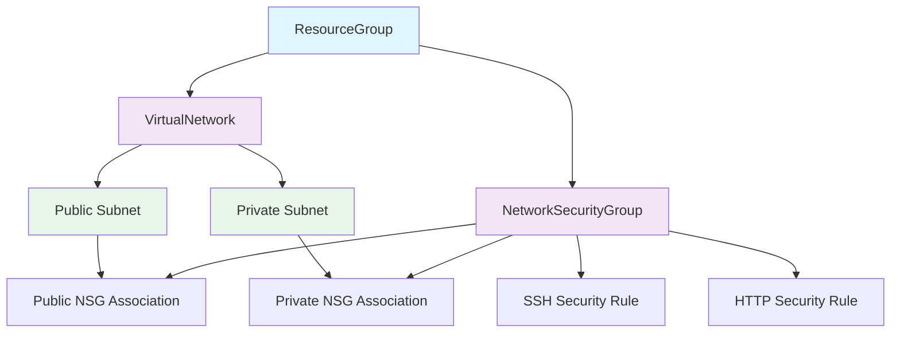

# Module 2: Networking Composition

**Time:** 30 minutes  
**Objective:** Extend your development environment with complete networking infrastructure including subnets and security groups

## Overview

In the previous module, you created a basic development environment with a Resource Group and Virtual Network. Now we'll add the networking components that make environments actually usable:

- **Subnets** for organizing workloads
- **Network Security Groups** for traffic control
- **Resource dependencies** and cross-references
- **Advanced patching** techniques

**What developers will get:**
- Complete networking stack ready for workloads
- Proper security boundaries
- Multiple subnets for different purposes
- Production-ready network architecture

## Step 1: Enhance the XRD

Let's extend our API to support networking configuration:

```yaml
# platform-core/xrds/dev-environment-xrd.yaml (UPDATE)
apiVersion: apiextensions.crossplane.io/v2
kind: CompositeResourceDefinition
metadata:
  name: xdevenvironments.platform.tutorial.com
  labels:
    app: crossplane-tutorial
    component: xrd
spec:
  group: platform.tutorial.com
  names:
    kind: XDevEnvironment
    plural: xdevenvironments
  scope: Namespaced
  versions:
  - name: v1alpha1
    served: true
    referenceable: true
    schema:
      openAPIV3Schema:
        type: object
        properties:
          spec:
            type: object
            properties:
              parameters:
                type: object
                properties:
                  name:
                    type: string
                    description: "Name of the development environment"
                    pattern: '^[a-z0-9-]+$'
                    minLength: 3
                    maxLength: 20
                  region:
                    type: string
                    description: "Azure region for deployment"
                    default: "eastus"
                    enum: ["eastus", "westus2", "eastus2", "westeurope"]
                  resourceGroupLocation:
                    type: string
                    description: "Specific location for Azure resource group"
                    default: "East US"
                  networking:
                    type: object
                    description: "Networking configuration"
                    properties:
                      vnetCidr:
                        type: string
                        description: "CIDR block for the virtual network"
                        default: "10.0.0.0/16"
                        pattern: '^([0-9]{1,3}\.){3}[0-9]{1,3}/[0-9]{1,2}$'
                      publicSubnetCidr:
                        type: string
                        description: "CIDR block for public subnet"
                        default: "10.0.1.0/24"
                        pattern: '^([0-9]{1,3}\.){3}[0-9]{1,3}/[0-9]{1,2}$'
                      privateSubnetCidr:
                        type: string
                        description: "CIDR block for private subnet"
                        default: "10.0.2.0/24"
                        pattern: '^([0-9]{1,3}\.){3}[0-9]{1,3}/[0-9]{1,2}$'
                      allowSshFrom:
                        type: array
                        description: "CIDR blocks allowed to SSH (port 22)"
                        items:
                          type: string
                        default: ["0.0.0.0/0"]
                      allowHttpFrom:
                        type: array
                        description: "CIDR blocks allowed HTTP traffic (port 80/443)"
                        items:
                          type: string
                        default: ["0.0.0.0/0"]
                  tags:
                    type: object
                    description: "Additional tags for resources"
                    additionalProperties:
                      type: string
                required:
                - name
            required:
            - parameters
          status:
            type: object
            properties:
              resourceGroupId:
                type: string
                description: "Azure Resource Group ID"
              virtualNetworkId:
                type: string
                description: "Azure Virtual Network ID"
              publicSubnetId:
                type: string
                description: "Public subnet ID"
              privateSubnetId:
                type: string
                description: "Private subnet ID"
              networkSecurityGroupId:
                type: string
                description: "Network security group ID"
              ready:
                type: boolean
                description: "Environment is ready for use"
              networkingReady:
                type: boolean
                description: "All networking components are ready"
```

## Step 2: Enhanced Composition with Networking

Now let's update our Composition to include networking resources:

```yaml
# platform-core/compositions/dev-environment-composition.yaml (UPDATE)
apiVersion: apiextensions.crossplane.io/v1
kind: Composition
metadata:
  name: dev-environment-azure
  labels:
    provider: azure
    service: development
    app: crossplane-tutorial
spec:
  compositeTypeRef:
    apiVersion: platform.tutorial.com/v1alpha1
    kind: XDevEnvironment
  
  resources:
  - name: resource-group
    base:
      apiVersion: azure.upbound.io/v1beta1
      kind: ResourceGroup
      spec:
        forProvider:
          tags:
            managed-by: crossplane
            environment: development
            created-by: crossplane-tutorial
    patches:
    # Copy environment name to resource group name
    - type: FromCompositeFieldPath
      fromFieldPath: spec.parameters.name
      toFieldPath: metadata.name
      transforms:
      - type: string
        string:
          fmt: "%s-rg"
    
    # Copy region to Azure location
    - type: FromCompositeFieldPath
      fromFieldPath: spec.parameters.resourceGroupLocation
      toFieldPath: spec.forProvider.location
    
    # Add environment name to tags
    - type: FromCompositeFieldPath
      fromFieldPath: spec.parameters.name
      toFieldPath: spec.forProvider.tags["environment-name"]
    
    # Merge user-provided tags
    - type: FromCompositeFieldPath
      fromFieldPath: spec.parameters.tags
      toFieldPath: spec.forProvider.tags
      policy:
        mergeOptions:
          keepMapValues: true
    
    # Report back the resource group ID
    - type: ToCompositeFieldPath
      fromFieldPath: status.atProvider.id
      toFieldPath: status.resourceGroupId
    
    # Set labels for resource selection
    - type: FromCompositeFieldPath
      fromFieldPath: metadata.uid
      toFieldPath: metadata.labels["crossplane.io/composite"]

  - name: virtual-network
    base:
      apiVersion: network.azure.upbound.io/v1beta1
      kind: VirtualNetwork
      spec:
        forProvider:
          tags:
            managed-by: crossplane
            environment: development
            resource-type: virtual-network
    patches:
    # Copy environment name to VNet name
    - type: FromCompositeFieldPath
      fromFieldPath: spec.parameters.name
      toFieldPath: metadata.name
      transforms:
      - type: string
        string:
          fmt: "%s-vnet"
    
    # Reference the resource group by name
    - type: FromCompositeFieldPath
      fromFieldPath: spec.parameters.name
      toFieldPath: spec.forProvider.resourceGroupName
      transforms:
      - type: string
        string:
          fmt: "%s-rg"
    
    # Copy region to Azure location
    - type: FromCompositeFieldPath
      fromFieldPath: spec.parameters.resourceGroupLocation
      toFieldPath: spec.forProvider.location
    
    # Set VNet CIDR from parameters
    - type: FromCompositeFieldPath
      fromFieldPath: spec.parameters.networking.vnetCidr
      toFieldPath: spec.forProvider.addressSpace[0]
    
    # Add environment name to tags
    - type: FromCompositeFieldPath
      fromFieldPath: spec.parameters.name
      toFieldPath: spec.forProvider.tags["environment-name"]
    
    # Merge user-provided tags
    - type: FromCompositeFieldPath
      fromFieldPath: spec.parameters.tags
      toFieldPath: spec.forProvider.tags
      policy:
        mergeOptions:
          keepMapValues: true
    
    # Report back the VNet ID
    - type: ToCompositeFieldPath
      fromFieldPath: status.atProvider.id
      toFieldPath: status.virtualNetworkId
    
    # Set labels for resource selection
    - type: FromCompositeFieldPath
      fromFieldPath: metadata.uid
      toFieldPath: metadata.labels["crossplane.io/composite"]

  - name: network-security-group
    base:
      apiVersion: network.azure.upbound.io/v1beta1
      kind: NetworkSecurityGroup
      spec:
        forProvider:
          tags:
            managed-by: crossplane
            environment: development
            resource-type: network-security-group
    patches:
    # Copy environment name to NSG name
    - type: FromCompositeFieldPath
      fromFieldPath: spec.parameters.name
      toFieldPath: metadata.name
      transforms:
      - type: string
        string:
          fmt: "%s-nsg"
    
    # Reference the resource group by name
    - type: FromCompositeFieldPath
      fromFieldPath: spec.parameters.name
      toFieldPath: spec.forProvider.resourceGroupName
      transforms:
      - type: string
        string:
          fmt: "%s-rg"
    
    # Copy region to Azure location
    - type: FromCompositeFieldPath
      fromFieldPath: spec.parameters.resourceGroupLocation
      toFieldPath: spec.forProvider.location
    
    # Add environment name to tags
    - type: FromCompositeFieldPath
      fromFieldPath: spec.parameters.name
      toFieldPath: spec.forProvider.tags["environment-name"]
    
    # Merge user-provided tags
    - type: FromCompositeFieldPath
      fromFieldPath: spec.parameters.tags
      toFieldPath: spec.forProvider.tags
      policy:
        mergeOptions:
          keepMapValues: true
    
    # Report back the NSG ID
    - type: ToCompositeFieldPath
      fromFieldPath: status.atProvider.id
      toFieldPath: status.networkSecurityGroupId
    
    # Set labels for resource selection
    - type: FromCompositeFieldPath
      fromFieldPath: metadata.uid
      toFieldPath: metadata.labels["crossplane.io/composite"]

  - name: ssh-security-rule
    base:
      apiVersion: network.azure.upbound.io/v1beta1
      kind: NetworkSecurityRule
      spec:
        forProvider:
          priority: 1001
          direction: "Inbound"
          access: "Allow"
          protocol: "Tcp"
          destinationPortRange: "22"
          destinationAddressPrefix: "*"
    patches:
    # Copy environment name to rule name
    - type: FromCompositeFieldPath
      fromFieldPath: spec.parameters.name
      toFieldPath: metadata.name
      transforms:
      - type: string
        string:
          fmt: "%s-ssh-rule"
    
    # Reference the resource group and NSG
    - type: FromCompositeFieldPath
      fromFieldPath: spec.parameters.name
      toFieldPath: spec.forProvider.resourceGroupName
      transforms:
      - type: string
        string:
          fmt: "%s-rg"
    
    - type: FromCompositeFieldPath
      fromFieldPath: spec.parameters.name
      toFieldPath: spec.forProvider.networkSecurityGroupName
      transforms:
      - type: string
        string:
          fmt: "%s-nsg"
    
    # Set source addresses from parameters
    - type: FromCompositeFieldPath
      fromFieldPath: spec.parameters.networking.allowSshFrom
      toFieldPath: spec.forProvider.sourceAddressPrefixes
    
    # Set labels for resource selection
    - type: FromCompositeFieldPath
      fromFieldPath: metadata.uid
      toFieldPath: metadata.labels["crossplane.io/composite"]

  - name: http-security-rule
    base:
      apiVersion: network.azure.upbound.io/v1beta1
      kind: NetworkSecurityRule
      spec:
        forProvider:
          priority: 1002
          direction: "Inbound"
          access: "Allow"
          protocol: "Tcp"
          destinationPortRanges: ["80", "443"]
          destinationAddressPrefix: "*"
    patches:
    # Copy environment name to rule name
    - type: FromCompositeFieldPath
      fromFieldPath: spec.parameters.name
      toFieldPath: metadata.name
      transforms:
      - type: string
        string:
          fmt: "%s-http-rule"
    
    # Reference the resource group and NSG
    - type: FromCompositeFieldPath
      fromFieldPath: spec.parameters.name
      toFieldPath: spec.forProvider.resourceGroupName
      transforms:
      - type: string
        string:
          fmt: "%s-rg"
    
    - type: FromCompositeFieldPath
      fromFieldPath: spec.parameters.name
      toFieldPath: spec.forProvider.networkSecurityGroupName
      transforms:
      - type: string
        string:
          fmt: "%s-nsg"
    
    # Set source addresses from parameters
    - type: FromCompositeFieldPath
      fromFieldPath: spec.parameters.networking.allowHttpFrom
      toFieldPath: spec.forProvider.sourceAddressPrefixes
    
    # Set labels for resource selection
    - type: FromCompositeFieldPath
      fromFieldPath: metadata.uid
      toFieldPath: metadata.labels["crossplane.io/composite"]

  - name: public-subnet
    base:
      apiVersion: network.azure.upbound.io/v1beta1
      kind: Subnet
      spec:
        forProvider: {}
    patches:
    # Copy environment name to subnet name
    - type: FromCompositeFieldPath
      fromFieldPath: spec.parameters.name
      toFieldPath: metadata.name
      transforms:
      - type: string
        string:
          fmt: "%s-public-subnet"
    
    # Reference the resource group and VNet
    - type: FromCompositeFieldPath
      fromFieldPath: spec.parameters.name
      toFieldPath: spec.forProvider.resourceGroupName
      transforms:
      - type: string
        string:
          fmt: "%s-rg"
    
    - type: FromCompositeFieldPath
      fromFieldPath: spec.parameters.name
      toFieldPath: spec.forProvider.virtualNetworkName
      transforms:
      - type: string
        string:
          fmt: "%s-vnet"
    
    # Set subnet CIDR from parameters
    - type: FromCompositeFieldPath
      fromFieldPath: spec.parameters.networking.publicSubnetCidr
      toFieldPath: spec.forProvider.addressPrefixes[0]
    
    # Report back the subnet ID
    - type: ToCompositeFieldPath
      fromFieldPath: status.atProvider.id
      toFieldPath: status.publicSubnetId
    
    # Set labels for resource selection
    - type: FromCompositeFieldPath
      fromFieldPath: metadata.uid
      toFieldPath: metadata.labels["crossplane.io/composite"]

  - name: private-subnet
    base:
      apiVersion: network.azure.upbound.io/v1beta1
      kind: Subnet
      spec:
        forProvider: {}
    patches:
    # Copy environment name to subnet name
    - type: FromCompositeFieldPath
      fromFieldPath: spec.parameters.name
      toFieldPath: metadata.name
      transforms:
      - type: string
        string:
          fmt: "%s-private-subnet"
    
    # Reference the resource group and VNet
    - type: FromCompositeFieldPath
      fromFieldPath: spec.parameters.name
      toFieldPath: spec.forProvider.resourceGroupName
      transforms:
      - type: string
        string:
          fmt: "%s-rg"
    
    - type: FromCompositeFieldPath
      fromFieldPath: spec.parameters.name
      toFieldPath: spec.forProvider.virtualNetworkName
      transforms:
      - type: string
        string:
          fmt: "%s-vnet"
    
    # Set subnet CIDR from parameters
    - type: FromCompositeFieldPath
      fromFieldPath: spec.parameters.networking.privateSubnetCidr
      toFieldPath: spec.forProvider.addressPrefixes[0]
    
    # Report back the subnet ID
    - type: ToCompositeFieldPath
      fromFieldPath: status.atProvider.id
      toFieldPath: status.privateSubnetId
    
    # Set labels for resource selection
    - type: FromCompositeFieldPath
      fromFieldPath: metadata.uid
      toFieldPath: metadata.labels["crossplane.io/composite"]

  - name: subnet-nsg-association-public
    base:
      apiVersion: network.azure.upbound.io/v1beta1
      kind: SubnetNetworkSecurityGroupAssociation
      spec:
        forProvider: {}
    patches:
    # Name the association
    - type: FromCompositeFieldPath
      fromFieldPath: spec.parameters.name
      toFieldPath: metadata.name
      transforms:
      - type: string
        string:
          fmt: "%s-public-nsg-assoc"
    
    # Reference subnet by name selector
    - type: FromCompositeFieldPath
      fromFieldPath: spec.parameters.name
      toFieldPath: spec.forProvider.subnetIdSelector.matchLabels["crossplane.io/composite"]
      transforms:
      - type: string
        string:
          fmt: "%s-public-subnet"
    
    # Reference NSG by name selector  
    - type: FromCompositeFieldPath
      fromFieldPath: spec.parameters.name
      toFieldPath: spec.forProvider.networkSecurityGroupIdSelector.matchLabels["crossplane.io/composite"]
      transforms:
      - type: string
        string:
          fmt: "%s-nsg"
    
    # Set labels for resource selection
    - type: FromCompositeFieldPath
      fromFieldPath: metadata.uid
      toFieldPath: metadata.labels["crossplane.io/composite"]

  - name: subnet-nsg-association-private
    base:
      apiVersion: network.azure.upbound.io/v1beta1
      kind: SubnetNetworkSecurityGroupAssociation
      spec:
        forProvider: {}
    patches:
    # Name the association
    - type: FromCompositeFieldPath
      fromFieldPath: spec.parameters.name
      toFieldPath: metadata.name
      transforms:
      - type: string
        string:
          fmt: "%s-private-nsg-assoc"
    
    # Reference subnet by name selector
    - type: FromCompositeFieldPath
      fromFieldPath: spec.parameters.name
      toFieldPath: spec.forProvider.subnetIdSelector.matchLabels["crossplane.io/composite"]
      transforms:
      - type: string
        string:
          fmt: "%s-private-subnet"
    
    # Reference NSG by name selector
    - type: FromCompositeFieldPath
      fromFieldPath: spec.parameters.name
      toFieldPath: spec.forProvider.networkSecurityGroupIdSelector.matchLabels["crossplane.io/composite"]
      transforms:
      - type: string
        string:
          fmt: "%s-nsg"
    
    # Set labels for resource selection
    - type: FromCompositeFieldPath
      fromFieldPath: metadata.uid
      toFieldPath: metadata.labels["crossplane.io/composite"]

  # Set overall networking readiness
  - name: networking-readiness-check
    base:
      apiVersion: kubernetes.crossplane.io/v1alpha1
      kind: Object
      spec:
        forProvider:
          manifest:
            apiVersion: v1
            kind: ConfigMap
            metadata:
              namespace: crossplane-system
            data:
              ready: "true"
    patches:
    - type: FromCompositeFieldPath
      fromFieldPath: spec.parameters.name
      toFieldPath: metadata.name
      transforms:
      - type: string
        string:
          fmt: "%s-networking-ready"
    
    - type: FromCompositeFieldPath
      fromFieldPath: spec.parameters.name
      toFieldPath: spec.forProvider.manifest.metadata.name
      transforms:
      - type: string
        string:
          fmt: "%s-networking-ready"
    
    # Report networking readiness
    - type: ToCompositeFieldPath
      fromFieldPath: status.conditions[?(@.type=="Ready")].status
      toFieldPath: status.networkingReady
      transforms:
      - type: convert
        convert:
          toType: bool
```

## Step 3: Update Environment Examples

Let's update our example environments to use the new networking features:

```yaml
# applications/environments/alice-dev.yaml (UPDATE)
apiVersion: platform.tutorial.com/v1alpha1
kind: XDevEnvironment
metadata:
  name: alice-dev
  namespace: default
  labels:
    app: crossplane-tutorial
    owner: alice
    purpose: development
spec:
  parameters:
    name: alice-dev
    region: eastus
    resourceGroupLocation: "East US"
    networking:
      vnetCidr: "10.0.0.0/16"
      publicSubnetCidr: "10.0.1.0/24"
      privateSubnetCidr: "10.0.2.0/24"
      allowSshFrom:
        - "203.0.113.0/24"  # Alice's office IP range
        - "198.51.100.0/24" # VPN IP range
      allowHttpFrom:
        - "0.0.0.0/0"       # Allow HTTP from anywhere
    tags:
      owner: alice
      team: platform
      cost-center: "1234"
      purpose: development
      networking: enhanced
  crossplane:
    compositionRef:
      name: dev-environment-azure-networking
```

```yaml
# applications/environments/charlie-dev.yaml (NEW)
apiVersion: platform.tutorial.com/v1alpha1
kind: XDevEnvironment
metadata:
  name: charlie-dev
  namespace: default
  labels:
    app: crossplane-tutorial
    owner: charlie
    purpose: development
spec:
  parameters:
    name: charlie-dev
    region: westus2
    resourceGroupLocation: "West US 2"
    networking:
      vnetCidr: "10.1.0.0/16"  # Different IP range to avoid conflicts
      publicSubnetCidr: "10.1.1.0/24"
      privateSubnetCidr: "10.1.2.0/24"
      allowSshFrom:
        - "192.0.2.0/24"     # Charlie's specific IP range
      allowHttpFrom:
        - "0.0.0.0/0"
    tags:
      owner: charlie
      team: backend
      cost-center: "5678"
      purpose: development
  crossplane:
    compositionRef:
      name: dev-environment-azure-networking
      networking: enhanced
```

## Step 4: Deploy Enhanced Platform

### 4.1 Commit Changes

```bash
# Add all updated files
git add platform-core/xrds/dev-environment-xrd.yaml
git add platform-core/compositions/dev-environment-composition.yaml
git add applications/environments/

# Commit with descriptive message
git commit -m "feat: enhance XDevEnvironment with complete networking

- Add subnets (public/private) with configurable CIDR blocks
- Implement Network Security Groups with SSH/HTTP rules
- Add subnet-NSG associations for proper security
- Support custom source IP ranges for security rules
- Expose networking resource IDs in status
- Add networking readiness indicators
- Update examples with enhanced networking configuration"

# Push to trigger GitOps deployment
git push
```

### 4.2 Watch Platform Update

```bash
# Watch ArgoCD sync the platform components
kubectl get applications -n argocd | grep platform

# Check XRD update
kubectl describe xrd xdevenvironments.platform.tutorial.com

# Check composition update
kubectl describe composition dev-environment-azure
```

## Step 5: Test Enhanced Networking

### 5.1 Update Existing Environment

Let's update Alice's environment to use the new networking features:

```bash
# The updated alice-dev.yaml will be synced automatically by ArgoCD
# Watch the environment update
kubectl get xdevenvironment alice-dev -n default -w
```

### 5.2 Check All Created Resources

```bash
# List all managed resources for Alice's environment (in same namespace as XR)
kubectl get managed -n default | grep alice-dev

# Check specific resource types
kubectl get resourcegroups,virtualnetworks,subnets,networksecuritygroups,networksecurityrules -n default | grep alice-dev
```

### 5.3 Verify Azure Infrastructure

```bash
# Check resource group and VNet
az group show --name alice-dev-rg --output table
az network vnet show --resource-group alice-dev-rg --name alice-dev-vnet --output table

# Check subnets
az network vnet subnet list --resource-group alice-dev-rg --vnet-name alice-dev-vnet --output table

# Check network security group and rules
az network nsg show --resource-group alice-dev-rg --name alice-dev-nsg --output table
az network nsg rule list --resource-group alice-dev-rg --nsg-name alice-dev-nsg --output table
```

### 5.4 Check Environment Status

```bash
# Get detailed environment status including networking
kubectl get xdevenvironment alice-dev -n default -o yaml | grep -A 15 status

# Should show:
# - resourceGroupId
# - virtualNetworkId  
# - publicSubnetId
# - privateSubnetId
# - networkSecurityGroupId
# - ready: true
# - networkingReady: true
```

## Step 6: Create Charlie's Environment

Let's test our enhanced platform with a new environment:

```bash
# Add Charlie's environment file
git add applications/environments/charlie-dev.yaml
git commit -m "feat: create Charlie's enhanced development environment"
git push

# Watch it being created
kubectl get xdevenvironments -n default -w

# Check all resources created (in same namespace)
kubectl get managed -n default | grep charlie-dev
```

## Understanding Advanced Composition Patterns

### Resource Dependencies

Our composition demonstrates several dependency patterns:



### Advanced Patching Techniques

#### String Formatting
```yaml
transforms:
- type: string
  string:
    fmt: "%s-subnet"  # Appends "-subnet" to the name
```

#### Array Patching
```yaml
# Copy array of IP ranges to security rule
fromFieldPath: spec.parameters.networking.allowSshFrom
toFieldPath: spec.forProvider.sourceAddressPrefixes
```

#### Conditional Logic
```yaml
# Convert string status to boolean
transforms:
- type: convert
  convert:
    toType: bool
```

#### Resource Selectors
```yaml
# Reference resources by labels instead of names
spec.forProvider.subnetIdSelector.matchLabels["crossplane.io/composite"]
```

## Production Networking Patterns

### 1. Network Segmentation

```yaml
# In a production XRD, you might have:
networking:
  subnets:
    - name: web
      cidr: "10.0.1.0/24"
      type: public
    - name: app  
      cidr: "10.0.2.0/24"
      type: private
    - name: data
      cidr: "10.0.3.0/24" 
      type: private
```

### 2. Security Rules Management

```yaml
# Structured security rules
securityRules:
  - name: allow-web
    priority: 100
    protocol: TCP
    ports: [80, 443]
    source: "0.0.0.0/0"
  - name: allow-ssh
    priority: 200  
    protocol: TCP
    ports: [22]
    source: "office-ip-range"
```

### 3. DNS Integration

```yaml
# DNS zones and records
dnsZone: "dev.company.com"
createPublicDns: true
privateDnsZone: "internal.dev.company.com"
```

## Troubleshooting Networking Issues

### Common Problems

#### 1. Subnet Creation Fails

```bash
# Check VNet status first
kubectl describe virtualnetwork alice-dev-vnet -n crossplane-system

# Check subnet events
kubectl describe subnet alice-dev-public-subnet -n crossplane-system
```

#### 2. NSG Association Fails

```bash
# Check if both resources exist
kubectl get networksecuritygroup alice-dev-nsg -n crossplane-system
kubectl get subnet alice-dev-public-subnet -n crossplane-system

# Check association status
kubectl describe subnetnetworksecuritygroupassociation alice-dev-public-nsg-assoc -n crossplane-system
```

#### 3. Resource Reference Issues

```bash
# Check resource labels for selector matching
kubectl get subnet alice-dev-public-subnet -n crossplane-system -o yaml | grep -A 5 labels

# Verify composite resource UID
kubectl get xdevenvironment alice-dev -n crossplane-system -o jsonpath='{.metadata.uid}'
```

## Learning Outcomes

After completing this module, you should understand:

- ✅ **Complex Resource Composition**: Orchestrating multiple interdependent resources
- ✅ **Advanced Patching**: String formatting, array handling, and type conversion
- ✅ **Resource Selection**: Using selectors instead of hard-coded names
- ✅ **Security Patterns**: Implementing network security best practices
- ✅ **Status Propagation**: Exposing detailed resource information to developers

## Architecture Benefits

### Developer Experience
- **Single YAML file** creates complete networking infrastructure
- **Configurable security** without Azure expertise required
- **Clear status reporting** shows all created resource IDs
- **Consistent patterns** across all environments

### Operations Benefits
- **Standardized networking** across all environments
- **Automated security group management** reduces human error
- **Consistent IP addressing** prevents conflicts
- **GitOps deployment** provides audit trail and rollback

## Next Steps

Your development environment platform now provides complete networking infrastructure! Developers get production-ready networking with subnets, security groups, and proper traffic controls.

In the next module, we'll implement environment-specific patterns to handle different requirements for development, staging, and production environments.

**➡️ [Module 3: Environment Patterns](03-environment-patterns.md)**

---

## Quick Reference

### Networking Commands

```bash
# List all networking resources
kubectl get virtualnetworks,subnets,networksecuritygroups,networksecurityrules -n crossplane-system

# Check environment networking status
kubectl get devenvironment <name> -n crossplane-system -o jsonpath='{.status}'

# Azure networking verification
az network vnet list --output table
az network vnet subnet list --resource-group <rg-name> --vnet-name <vnet-name> --output table
az network nsg list --output table
```

### File Structure After This Module

```
platform-core/
├── xrds/
│   └── dev-environment-xrd.yaml          # Enhanced with networking parameters
├── compositions/
│   └── dev-environment-composition.yaml  # Added subnets, NSGs, security rules
├── environments/
│   ├── alice-dev.yaml                    # Updated with networking config
│   ├── bob-dev.yaml                      # Existing environment
│   └── charlie-dev.yaml                 # New environment with networking
└── applications/
    ├── platform-apis.yaml
    └── dev-environments.yaml
```
