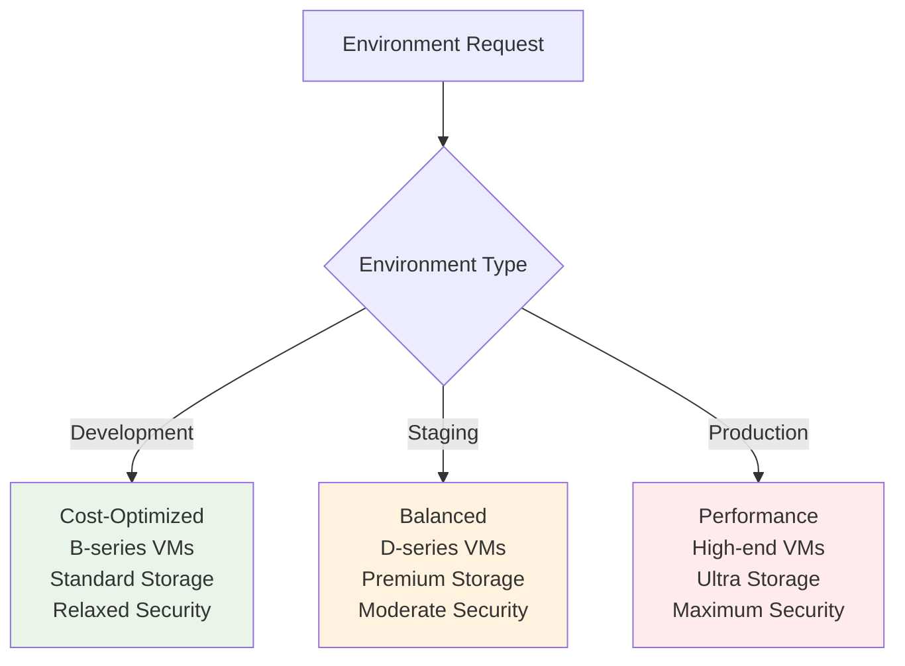
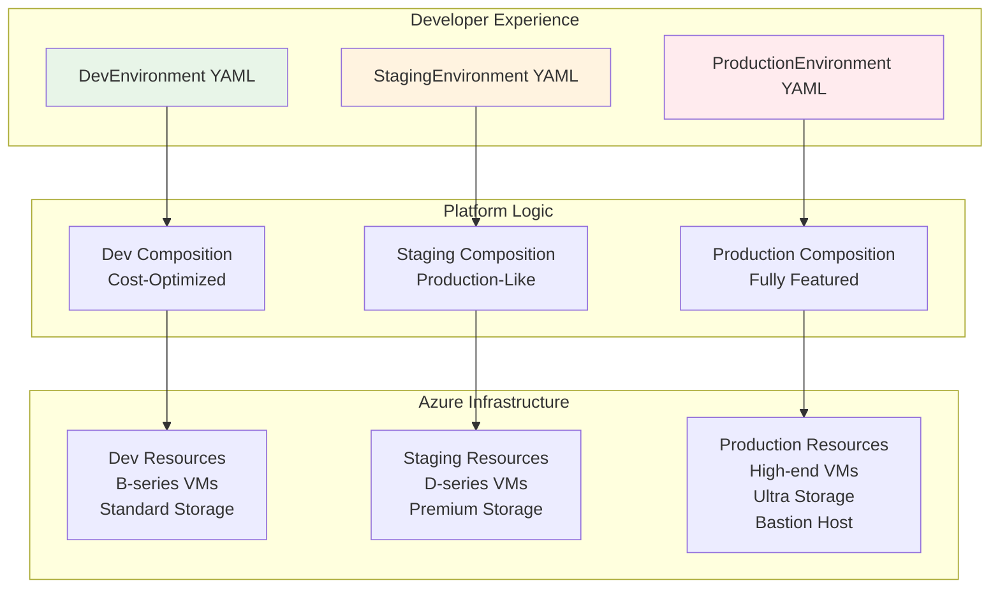

# Module 3: Environment Patterns

**Time:** 60 minutes  
**Objective:** Implement environment-specific patterns for development, staging, and production with appropriate resource sizing, security, and cost optimization

## Overview

Different environments have different requirements:

- **Development**: Cost-optimized, relaxed security, developer-friendly
- **Staging**: Production-like, testing-focused, moderate security
- **Production**: High availability, strict security, performance-optimized

Instead of one-size-fits-all, we'll create environment-specific Compositions that automatically apply the right patterns based on environment type.

**What you'll build:**
- Multiple Compositions for different environment types
- Environment-aware resource sizing and configuration
- Cost optimization patterns
- Security policies per environment
- Production-ready governance

## Step 1: Design Environment-Specific APIs

### 1.1 Create Environment-Specific XRDs

Let's create dedicated XRDs for different environment types:

```yaml
# platform-core/xrds/environment-dev-xrd.yaml
apiVersion: apiextensions.crossplane.io/v2
kind: CompositeResourceDefinition
metadata:
  name: xdevenvironments.environments.platform.tutorial.com
  labels:
    app: crossplane-tutorial
    component: xrd
    environment-type: development
spec:
  group: environments.platform.tutorial.com
  names:
    kind: XDevEnvironment
    plural: xdevenvironments
  scope: Namespaced
  versions:
  - name: v1alpha1
    served: true
    referenceable: true
    schema:
      openAPIV3Schema:
        type: object
        properties:
          spec:
            type: object
            properties:
              parameters:
                type: object
                properties:
                  name:
                    type: string
                    description: "Name of the development environment"
                    pattern: '^[a-z0-9-]+$'
                    minLength: 3
                    maxLength: 20
                  owner:
                    type: string
                    description: "Environment owner (developer name)"
                    pattern: '^[a-z0-9.-]+$'
                  team:
                    type: string
                    description: "Team responsible for this environment"
                    pattern: '^[a-z0-9-]+$'
                  region:
                    type: string
                    description: "Azure region for deployment"
                    default: "eastus"
                    enum: ["eastus", "westus2", "eastus2"]
                  costLimit:
                    type: string
                    description: "Maximum monthly cost limit"
                    default: "$50"
                    enum: ["$25", "$50", "$100", "$200"]
                  autoShutdown:
                    type: object
                    description: "Auto-shutdown configuration to save costs"
                    properties:
                      enabled:
                        type: boolean
                        default: true
                      schedule:
                        type: string
                        description: "Shutdown schedule in cron format"
                        default: "0 18 * * 1-5"  # 6 PM weekdays
                      timezone:
                        type: string
                        default: "UTC"
                  networking:
                    type: object
                    properties:
                      vnetCidr:
                        type: string
                        default: "10.0.0.0/16"
                      allowSshFrom:
                        type: array
                        items:
                          type: string
                        default: ["0.0.0.0/0"]  # Relaxed for dev
                      allowRdpFrom:
                        type: array
                        items:
                          type: string
                        default: ["0.0.0.0/0"]  # Relaxed for dev
                  compute:
                    type: object
                    description: "Compute resource specifications"
                    properties:
                      vmSize:
                        type: string
                        description: "VM size for compute resources"
                        default: "Standard_B2s"  # Cost-optimized
                        enum: ["Standard_B1s", "Standard_B2s", "Standard_B4ms"]
                      diskType:
                        type: string
                        description: "Disk type for cost optimization"
                        default: "Standard_LRS"
                        enum: ["Standard_LRS", "StandardSSD_LRS"]
                required:
                - name
                - owner
                - team
            required:
            - parameters
```

```yaml
# platform-core/xrds/environment-staging-xrd.yaml
apiVersion: apiextensions.crossplane.io/v2
kind: CompositeResourceDefinition
metadata:
  name: xstagingenvironments.environments.platform.tutorial.com
  labels:
    app: crossplane-tutorial
    component: xrd
    environment-type: staging
spec:
  group: environments.platform.tutorial.com
  names:
    kind: XStagingEnvironment
    plural: xstagingenvironments
  scope: Namespaced
  versions:
  - name: v1alpha1
    served: true
    referenceable: true
    schema:
      openAPIV3Schema:
        type: object
        properties:
          spec:
            type: object
            properties:
              parameters:
                type: object
                properties:
                  name:
                    type: string
                    description: "Name of the staging environment"
                    pattern: '^[a-z0-9-]+-staging$'
                    minLength: 10
                    maxLength: 30
                  team:
                    type: string
                    description: "Team responsible for this environment"
                    pattern: '^[a-z0-9-]+$'
                  region:
                    type: string
                    description: "Azure region for deployment"
                    default: "eastus"
                    enum: ["eastus", "westus2", "eastus2", "westeurope"]
                  highAvailability:
                    type: boolean
                    description: "Enable high availability features"
                    default: false
                  backupRetention:
                    type: integer
                    description: "Backup retention in days"
                    default: 7
                    minimum: 7
                    maximum: 30
                  monitoring:
                    type: object
                    properties:
                      alerting:
                        type: boolean
                        default: true
                      metricsRetention:
                        type: integer
                        default: 30
                  networking:
                    type: object
                    properties:
                      vnetCidr:
                        type: string
                        default: "10.1.0.0/16"
                      allowSshFrom:
                        type: array
                        items:
                          type: string
                        default: ["10.0.0.0/8", "172.16.0.0/12"]  # More restrictive
                      enablePrivateEndpoints:
                        type: boolean
                        default: true
                  compute:
                    type: object
                    properties:
                      vmSize:
                        type: string
                        default: "Standard_D2s_v3"  # Performance-oriented
                        enum: ["Standard_D2s_v3", "Standard_D4s_v3", "Standard_D8s_v3"]
                      diskType:
                        type: string
                        default: "Premium_LRS"  # Better performance
                        enum: ["StandardSSD_LRS", "Premium_LRS"]
                required:
                - name
                - team
            required:
            - parameters
```

```yaml
# platform-core/xrds/environment-production-xrd.yaml
apiVersion: apiextensions.crossplane.io/v2
kind: CompositeResourceDefinition
metadata:
  name: xproductionenvironments.environments.platform.tutorial.com
  labels:
    app: crossplane-tutorial
    component: xrd
    environment-type: production
spec:
  group: environments.platform.tutorial.com
  names:
    kind: XProductionEnvironment
    plural: xproductionenvironments
  scope: Namespaced
  versions:
  - name: v1alpha1
    served: true
    referenceable: true
    schema:
      openAPIV3Schema:
        type: object
        properties:
          spec:
            type: object
            properties:
              parameters:
                type: object
                properties:
                  name:
                    type: string
                    description: "Name of the production environment"
                    pattern: '^[a-z0-9-]+-prod$'
                    minLength: 10
                    maxLength: 30
                  team:
                    type: string
                    description: "Team responsible for this environment"
                    pattern: '^[a-z0-9-]+$'
                  businessCriticality:
                    type: string
                    description: "Business criticality level"
                    enum: ["high", "critical"]
                    default: "high"
                  region:
                    type: string
                    description: "Primary Azure region"
                    default: "eastus"
                    enum: ["eastus", "westus2", "eastus2", "westeurope"]
                  multiRegion:
                    type: object
                    properties:
                      enabled:
                        type: boolean
                        default: false
                      secondaryRegion:
                        type: string
                        enum: ["eastus", "westus2", "eastus2", "westeurope"]
                  backup:
                    type: object
                    properties:
                      retention:
                        type: integer
                        default: 90
                        minimum: 30
                        maximum: 365
                      geoRedundant:
                        type: boolean
                        default: true
                  security:
                    type: object
                    properties:
                      privateEndpoints:
                        type: boolean
                        default: true
                      encryptionAtRest:
                        type: boolean
                        default: true
                      networkIsolation:
                        type: boolean
                        default: true
                  monitoring:
                    type: object
                    properties:
                      alerting:
                        type: boolean
                        default: true
                      metricsRetention:
                        type: integer
                        default: 90
                      logRetention:
                        type: integer
                        default: 365
                  networking:
                    type: object
                    properties:
                      vnetCidr:
                        type: string
                        default: "10.2.0.0/16"
                      allowSshFrom:
                        type: array
                        items:
                          type: string
                        default: ["10.0.0.0/8"]  # Very restrictive
                      bastionHost:
                        type: boolean
                        default: true
                  compute:
                    type: object
                    properties:
                      vmSize:
                        type: string
                        default: "Standard_D4s_v3"
                        enum: ["Standard_D4s_v3", "Standard_D8s_v3", "Standard_D16s_v3"]
                      diskType:
                        type: string
                        default: "Premium_LRS"
                        enum: ["Premium_LRS", "UltraSSD_LRS"]
                      availabilityZones:
                        type: boolean
                        default: true
                required:
                - name
                - team
                - businessCriticality
            required:
            - parameters
```

## Step 2: Environment-Specific Compositions

### 2.1 Development Environment Composition

```yaml
# platform-core/compositions/environment-dev-composition.yaml
apiVersion: apiextensions.crossplane.io/v1
kind: Composition
metadata:
  name: dev-environment-azure
  labels:
    provider: azure
    environment: development
    cost-optimized: "true"
    app: crossplane-tutorial
spec:
  compositeTypeRef:
    apiVersion: environments.platform.tutorial.com/v1alpha1
    kind: XDevEnvironment
  
  resources:
  - name: resource-group
    base:
      apiVersion: azure.upbound.io/v1beta1
      kind: ResourceGroup
      spec:
        forProvider:
          tags:
            managed-by: crossplane
            environment: development
            cost-optimization: enabled
            auto-shutdown: enabled
    patches:
    - type: FromCompositeFieldPath
      fromFieldPath: spec.parameters.name
      toFieldPath: metadata.name
      transforms:
      - type: string
        string:
          fmt: "%s-dev-rg"
    
    - type: FromCompositeFieldPath
      fromFieldPath: spec.parameters.region
      toFieldPath: spec.forProvider.location
      transforms:
      - type: map
        map:
          eastus: "East US"
          westus2: "West US 2"
          eastus2: "East US 2"
    
    - type: FromCompositeFieldPath
      fromFieldPath: spec.parameters.owner
      toFieldPath: spec.forProvider.tags["owner"]
    
    - type: FromCompositeFieldPath
      fromFieldPath: spec.parameters.team
      toFieldPath: spec.forProvider.tags["team"]
    
    - type: FromCompositeFieldPath
      fromFieldPath: spec.parameters.costLimit
      toFieldPath: spec.forProvider.tags["cost-limit"]

  - name: virtual-network
    base:
      apiVersion: network.azure.upbound.io/v1beta1
      kind: VirtualNetwork
      spec:
        forProvider:
          tags:
            managed-by: crossplane
            environment: development
            network-type: basic
    patches:
    - type: FromCompositeFieldPath
      fromFieldPath: spec.parameters.name
      toFieldPath: metadata.name
      transforms:
      - type: string
        string:
          fmt: "%s-dev-vnet"
    
    - type: FromCompositeFieldPath
      fromFieldPath: spec.parameters.name
      toFieldPath: spec.forProvider.resourceGroupName
      transforms:
      - type: string
        string:
          fmt: "%s-dev-rg"
    
    - type: FromCompositeFieldPath
      fromFieldPath: spec.parameters.region
      toFieldPath: spec.forProvider.location
      transforms:
      - type: map
        map:
          eastus: "East US"
          westus2: "West US 2"
          eastus2: "East US 2"
    
    - type: FromCompositeFieldPath
      fromFieldPath: spec.parameters.networking.vnetCidr
      toFieldPath: spec.forProvider.addressSpace[0]

  - name: dev-subnet
    base:
      apiVersion: network.azure.upbound.io/v1beta1
      kind: Subnet
      spec:
        forProvider:
          addressPrefixes: ["10.0.1.0/24"]
    patches:
    - type: FromCompositeFieldPath
      fromFieldPath: spec.parameters.name
      toFieldPath: metadata.name
      transforms:
      - type: string
        string:
          fmt: "%s-dev-subnet"
    
    - type: FromCompositeFieldPath
      fromFieldPath: spec.parameters.name
      toFieldPath: spec.forProvider.resourceGroupName
      transforms:
      - type: string
        string:
          fmt: "%s-dev-rg"
    
    - type: FromCompositeFieldPath
      fromFieldPath: spec.parameters.name
      toFieldPath: spec.forProvider.virtualNetworkName
      transforms:
      - type: string
        string:
          fmt: "%s-dev-vnet"

  - name: dev-nsg
    base:
      apiVersion: network.azure.upbound.io/v1beta1
      kind: NetworkSecurityGroup
      spec:
        forProvider:
          tags:
            managed-by: crossplane
            environment: development
            security-level: relaxed
    patches:
    - type: FromCompositeFieldPath
      fromFieldPath: spec.parameters.name
      toFieldPath: metadata.name
      transforms:
      - type: string
        string:
          fmt: "%s-dev-nsg"
    
    - type: FromCompositeFieldPath
      fromFieldPath: spec.parameters.name
      toFieldPath: spec.forProvider.resourceGroupName
      transforms:
      - type: string
        string:
          fmt: "%s-dev-rg"

  # Dev-specific: Allow SSH from anywhere (relaxed security)
  - name: ssh-rule-dev
    base:
      apiVersion: network.azure.upbound.io/v1beta1
      kind: NetworkSecurityRule
      spec:
        forProvider:
          priority: 1000
          direction: "Inbound"
          access: "Allow"
          protocol: "Tcp"
          destinationPortRange: "22"
          destinationAddressPrefix: "*"
    patches:
    - type: FromCompositeFieldPath
      fromFieldPath: spec.parameters.name
      toFieldPath: metadata.name
      transforms:
      - type: string
        string:
          fmt: "%s-ssh-dev-rule"
    
    - type: FromCompositeFieldPath
      fromFieldPath: spec.parameters.name
      toFieldPath: spec.forProvider.resourceGroupName
      transforms:
      - type: string
        string:
          fmt: "%s-dev-rg"
    
    - type: FromCompositeFieldPath
      fromFieldPath: spec.parameters.name
      toFieldPath: spec.forProvider.networkSecurityGroupName
      transforms:
      - type: string
        string:
          fmt: "%s-dev-nsg"
    
    - type: FromCompositeFieldPath
      fromFieldPath: spec.parameters.networking.allowSshFrom
      toFieldPath: spec.forProvider.sourceAddressPrefixes

  # Dev-specific: Cost optimization automation
  - name: auto-shutdown-config
    base:
      apiVersion: kubernetes.crossplane.io/v1alpha1
      kind: Object
      spec:
        forProvider:
          manifest:
            apiVersion: v1
            kind: ConfigMap
            metadata:
              namespace: crossplane-system
            data:
              enabled: "true"
              schedule: "0 18 * * 1-5"
              timezone: "UTC"
    patches:
    - type: FromCompositeFieldPath
      fromFieldPath: spec.parameters.name
      toFieldPath: metadata.name
      transforms:
      - type: string
        string:
          fmt: "%s-autoshutdown-config"
    
    - type: FromCompositeFieldPath
      fromFieldPath: spec.parameters.name
      toFieldPath: spec.forProvider.manifest.metadata.name
      transforms:
      - type: string
        string:
          fmt: "%s-autoshutdown-config"
    
    - type: FromCompositeFieldPath
      fromFieldPath: spec.parameters.autoShutdown.enabled
      toFieldPath: spec.forProvider.manifest.data.enabled
      transforms:
      - type: convert
        convert:
          toType: string
    
    - type: FromCompositeFieldPath
      fromFieldPath: spec.parameters.autoShutdown.schedule
      toFieldPath: spec.forProvider.manifest.data.schedule
```

### 2.2 Staging Environment Composition

```yaml
# platform-core/compositions/environment-staging-composition.yaml
apiVersion: apiextensions.crossplane.io/v1
kind: Composition
metadata:
  name: staging-environment-azure
  labels:
    provider: azure
    environment: staging
    production-like: "true"
    app: crossplane-tutorial
spec:
  compositeTypeRef:
    apiVersion: environments.platform.tutorial.com/v1alpha1
    kind: XStagingEnvironment
  
  resources:
  - name: resource-group
    base:
      apiVersion: azure.upbound.io/v1beta1
      kind: ResourceGroup
      spec:
        forProvider:
          tags:
            managed-by: crossplane
            environment: staging
            production-like: "true"
            backup-enabled: "true"
    patches:
    - type: FromCompositeFieldPath
      fromFieldPath: spec.parameters.name
      toFieldPath: metadata.name
    
    - type: FromCompositeFieldPath
      fromFieldPath: spec.parameters.region
      toFieldPath: spec.forProvider.location
      transforms:
      - type: map
        map:
          eastus: "East US"
          westus2: "West US 2"
          eastus2: "East US 2"
          westeurope: "West Europe"
    
    - type: FromCompositeFieldPath
      fromFieldPath: spec.parameters.team
      toFieldPath: spec.forProvider.tags["team"]

  - name: virtual-network
    base:
      apiVersion: network.azure.upbound.io/v1beta1
      kind: VirtualNetwork
      spec:
        forProvider:
          tags:
            managed-by: crossplane
            environment: staging
            network-type: production-like
    patches:
    - type: FromCompositeFieldPath
      fromFieldPath: spec.parameters.name
      toFieldPath: metadata.name
      transforms:
      - type: string
        string:
          fmt: "%s-vnet"
    
    - type: FromCompositeFieldPath
      fromFieldPath: spec.parameters.name
      toFieldPath: spec.forProvider.resourceGroupName
    
    - type: FromCompositeFieldPath
      fromFieldPath: spec.parameters.region
      toFieldPath: spec.forProvider.location
      transforms:
      - type: map
        map:
          eastus: "East US"
          westus2: "West US 2"
          eastus2: "East US 2"
          westeurope: "West Europe"
    
    - type: FromCompositeFieldPath
      fromFieldPath: spec.parameters.networking.vnetCidr
      toFieldPath: spec.forProvider.addressSpace[0]

  # Multiple subnets for staging (more production-like)
  - name: app-subnet
    base:
      apiVersion: network.azure.upbound.io/v1beta1
      kind: Subnet
      spec:
        forProvider:
          addressPrefixes: ["10.1.1.0/24"]
    patches:
    - type: FromCompositeFieldPath
      fromFieldPath: spec.parameters.name
      toFieldPath: metadata.name
      transforms:
      - type: string
        string:
          fmt: "%s-app-subnet"
    
    - type: FromCompositeFieldPath
      fromFieldPath: spec.parameters.name
      toFieldPath: spec.forProvider.resourceGroupName
    
    - type: FromCompositeFieldPath
      fromFieldPath: spec.parameters.name
      toFieldPath: spec.forProvider.virtualNetworkName
      transforms:
      - type: string
        string:
          fmt: "%s-vnet"

  - name: data-subnet
    base:
      apiVersion: network.azure.upbound.io/v1beta1
      kind: Subnet
      spec:
        forProvider:
          addressPrefixes: ["10.1.2.0/24"]
    patches:
    - type: FromCompositeFieldPath
      fromFieldPath: spec.parameters.name
      toFieldPath: metadata.name
      transforms:
      - type: string
        string:
          fmt: "%s-data-subnet"
    
    - type: FromCompositeFieldPath
      fromFieldPath: spec.parameters.name
      toFieldPath: spec.forProvider.resourceGroupName
    
    - type: FromCompositeFieldPath
      fromFieldPath: spec.parameters.name
      toFieldPath: spec.forProvider.virtualNetworkName
      transforms:
      - type: string
        string:
          fmt: "%s-vnet"

  - name: staging-nsg
    base:
      apiVersion: network.azure.upbound.io/v1beta1
      kind: NetworkSecurityGroup
      spec:
        forProvider:
          tags:
            managed-by: crossplane
            environment: staging
            security-level: moderate
    patches:
    - type: FromCompositeFieldPath
      fromFieldPath: spec.parameters.name
      toFieldPath: metadata.name
      transforms:
      - type: string
        string:
          fmt: "%s-nsg"
    
    - type: FromCompositeFieldPath
      fromFieldPath: spec.parameters.name
      toFieldPath: spec.forProvider.resourceGroupName

  # Staging-specific: Restricted SSH access
  - name: ssh-rule-staging
    base:
      apiVersion: network.azure.upbound.io/v1beta1
      kind: NetworkSecurityRule
      spec:
        forProvider:
          priority: 1000
          direction: "Inbound"
          access: "Allow"
          protocol: "Tcp"
          destinationPortRange: "22"
          destinationAddressPrefix: "*"
    patches:
    - type: FromCompositeFieldPath
      fromFieldPath: spec.parameters.name
      toFieldPath: metadata.name
      transforms:
      - type: string
        string:
          fmt: "%s-ssh-rule"
    
    - type: FromCompositeFieldPath
      fromFieldPath: spec.parameters.name
      toFieldPath: spec.forProvider.resourceGroupName
    
    - type: FromCompositeFieldPath
      fromFieldPath: spec.parameters.name
      toFieldPath: spec.forProvider.networkSecurityGroupName
      transforms:
      - type: string
        string:
          fmt: "%s-nsg"
    
    - type: FromCompositeFieldPath
      fromFieldPath: spec.parameters.networking.allowSshFrom
      toFieldPath: spec.forProvider.sourceAddressPrefixes

  # Staging-specific: Monitoring configuration
  - name: monitoring-config
    base:
      apiVersion: kubernetes.crossplane.io/v1alpha1
      kind: Object
      spec:
        forProvider:
          manifest:
            apiVersion: v1
            kind: ConfigMap
            metadata:
              namespace: crossplane-system
            data:
              alerting: "true"
              metrics-retention: "30"
              environment: "staging"
    patches:
    - type: FromCompositeFieldPath
      fromFieldPath: spec.parameters.name
      toFieldPath: metadata.name
      transforms:
      - type: string
        string:
          fmt: "%s-monitoring-config"
    
    - type: FromCompositeFieldPath
      fromFieldPath: spec.parameters.name
      toFieldPath: spec.forProvider.manifest.metadata.name
      transforms:
      - type: string
        string:
          fmt: "%s-monitoring-config"
    
    - type: FromCompositeFieldPath
      fromFieldPath: spec.parameters.monitoring.alerting
      toFieldPath: spec.forProvider.manifest.data.alerting
      transforms:
      - type: convert
        convert:
          toType: string
    
    - type: FromCompositeFieldPath
      fromFieldPath: spec.parameters.monitoring.metricsRetention
      toFieldPath: spec.forProvider.manifest.data.metrics-retention
      transforms:
      - type: convert
        convert:
          toType: string
```

### 2.3 Production Environment Composition

```yaml
# platform-core/compositions/environment-production-composition.yaml
apiVersion: apiextensions.crossplane.io/v1
kind: Composition
metadata:
  name: production-environment-azure
  labels:
    provider: azure
    environment: production
    high-availability: "true"
    security-hardened: "true"
    app: crossplane-tutorial
spec:
  compositeTypeRef:
    apiVersion: environments.platform.tutorial.com/v1alpha1
    kind: XProductionEnvironment
  
  resources:
  - name: resource-group
    base:
      apiVersion: azure.upbound.io/v1beta1
      kind: ResourceGroup
      spec:
        forProvider:
          tags:
            managed-by: crossplane
            environment: production
            high-availability: "true"
            backup-enabled: "true"
            encryption-enabled: "true"
    patches:
    - type: FromCompositeFieldPath
      fromFieldPath: spec.parameters.name
      toFieldPath: metadata.name
    
    - type: FromCompositeFieldPath
      fromFieldPath: spec.parameters.region
      toFieldPath: spec.forProvider.location
      transforms:
      - type: map
        map:
          eastus: "East US"
          westus2: "West US 2"
          eastus2: "East US 2"
          westeurope: "West Europe"
    
    - type: FromCompositeFieldPath
      fromFieldPath: spec.parameters.team
      toFieldPath: spec.forProvider.tags["team"]
    
    - type: FromCompositeFieldPath
      fromFieldPath: spec.parameters.businessCriticality
      toFieldPath: spec.forProvider.tags["criticality"]

  - name: virtual-network
    base:
      apiVersion: network.azure.upbound.io/v1beta1
      kind: VirtualNetwork
      spec:
        forProvider:
          tags:
            managed-by: crossplane
            environment: production
            network-type: enterprise
            security-level: high
    patches:
    - type: FromCompositeFieldPath
      fromFieldPath: spec.parameters.name
      toFieldPath: metadata.name
      transforms:
      - type: string
        string:
          fmt: "%s-vnet"
    
    - type: FromCompositeFieldPath
      fromFieldPath: spec.parameters.name
      toFieldPath: spec.forProvider.resourceGroupName
    
    - type: FromCompositeFieldPath
      fromFieldPath: spec.parameters.region
      toFieldPath: spec.forProvider.location
      transforms:
      - type: map
        map:
          eastus: "East US"
          westus2: "West US 2"
          eastus2: "East US 2"
          westeurope: "West Europe"
    
    - type: FromCompositeFieldPath
      fromFieldPath: spec.parameters.networking.vnetCidr
      toFieldPath: spec.forProvider.addressSpace[0]

  # Production: Multiple subnets with specific purposes
  - name: web-subnet
    base:
      apiVersion: network.azure.upbound.io/v1beta1
      kind: Subnet
      spec:
        forProvider:
          addressPrefixes: ["10.2.1.0/24"]
    patches:
    - type: FromCompositeFieldPath
      fromFieldPath: spec.parameters.name
      toFieldPath: metadata.name
      transforms:
      - type: string
        string:
          fmt: "%s-web-subnet"
    
    - type: FromCompositeFieldPath
      fromFieldPath: spec.parameters.name
      toFieldPath: spec.forProvider.resourceGroupName
    
    - type: FromCompositeFieldPath
      fromFieldPath: spec.parameters.name
      toFieldPath: spec.forProvider.virtualNetworkName
      transforms:
      - type: string
        string:
          fmt: "%s-vnet"

  - name: app-subnet
    base:
      apiVersion: network.azure.upbound.io/v1beta1
      kind: Subnet
      spec:
        forProvider:
          addressPrefixes: ["10.2.2.0/24"]
    patches:
    - type: FromCompositeFieldPath
      fromFieldPath: spec.parameters.name
      toFieldPath: metadata.name
      transforms:
      - type: string
        string:
          fmt: "%s-app-subnet"
    
    - type: FromCompositeFieldPath
      fromFieldPath: spec.parameters.name
      toFieldPath: spec.forProvider.resourceGroupName
    
    - type: FromCompositeFieldPath
      fromFieldPath: spec.parameters.name
      toFieldPath: spec.forProvider.virtualNetworkName
      transforms:
      - type: string
        string:
          fmt: "%s-vnet"

  - name: data-subnet
    base:
      apiVersion: network.azure.upbound.io/v1beta1
      kind: Subnet
      spec:
        forProvider:
          addressPrefixes: ["10.2.3.0/24"]
    patches:
    - type: FromCompositeFieldPath
      fromFieldPath: spec.parameters.name
      toFieldPath: metadata.name
      transforms:
      - type: string
        string:
          fmt: "%s-data-subnet"
    
    - type: FromCompositeFieldPath
      fromFieldPath: spec.parameters.name
      toFieldPath: spec.forProvider.resourceGroupName
    
    - type: FromCompositeFieldPath
      fromFieldPath: spec.parameters.name
      toFieldPath: spec.forProvider.virtualNetworkName
      transforms:
      - type: string
        string:
          fmt: "%s-vnet"

  # Production-specific: Bastion subnet for secure access
  - name: bastion-subnet
    base:
      apiVersion: network.azure.upbound.io/v1beta1
      kind: Subnet
      spec:
        forProvider:
          addressPrefixes: ["10.2.4.0/24"]
          name: "AzureBastionSubnet"  # Required name for Bastion
    patches:
    - type: FromCompositeFieldPath
      fromFieldPath: spec.parameters.name
      toFieldPath: metadata.name
      transforms:
      - type: string
        string:
          fmt: "%s-bastion-subnet"
    
    - type: FromCompositeFieldPath
      fromFieldPath: spec.parameters.name
      toFieldPath: spec.forProvider.resourceGroupName
    
    - type: FromCompositeFieldPath
      fromFieldPath: spec.parameters.name
      toFieldPath: spec.forProvider.virtualNetworkName
      transforms:
      - type: string
        string:
          fmt: "%s-vnet"

  - name: production-nsg
    base:
      apiVersion: network.azure.upbound.io/v1beta1
      kind: NetworkSecurityGroup
      spec:
        forProvider:
          tags:
            managed-by: crossplane
            environment: production
            security-level: high
            compliance-required: "true"
    patches:
    - type: FromCompositeFieldPath
      fromFieldPath: spec.parameters.name
      toFieldPath: metadata.name
      transforms:
      - type: string
        string:
          fmt: "%s-nsg"
    
    - type: FromCompositeFieldPath
      fromFieldPath: spec.parameters.name
      toFieldPath: spec.forProvider.resourceGroupName

  # Production-specific: Very restrictive SSH access
  - name: ssh-rule-production
    base:
      apiVersion: network.azure.upbound.io/v1beta1
      kind: NetworkSecurityRule
      spec:
        forProvider:
          priority: 1000
          direction: "Inbound"
          access: "Allow"
          protocol: "Tcp"
          destinationPortRange: "22"
          destinationAddressPrefix: "*"
    patches:
    - type: FromCompositeFieldPath
      fromFieldPath: spec.parameters.name
      toFieldPath: metadata.name
      transforms:
      - type: string
        string:
          fmt: "%s-ssh-rule"
    
    - type: FromCompositeFieldPath
      fromFieldPath: spec.parameters.name
      toFieldPath: spec.forProvider.resourceGroupName
    
    - type: FromCompositeFieldPath
      fromFieldPath: spec.parameters.name
      toFieldPath: spec.forProvider.networkSecurityGroupName
      transforms:
      - type: string
        string:
          fmt: "%s-nsg"
    
    - type: FromCompositeFieldPath
      fromFieldPath: spec.parameters.networking.allowSshFrom
      toFieldPath: spec.forProvider.sourceAddressPrefixes

  # Production-specific: Comprehensive monitoring
  - name: monitoring-config
    base:
      apiVersion: kubernetes.crossplane.io/v1alpha1
      kind: Object
      spec:
        forProvider:
          manifest:
            apiVersion: v1
            kind: ConfigMap
            metadata:
              namespace: crossplane-system
            data:
              alerting: "true"
              metrics-retention: "90"
              log-retention: "365"
              environment: "production"
              high-availability: "true"
    patches:
    - type: FromCompositeFieldPath
      fromFieldPath: spec.parameters.name
      toFieldPath: metadata.name
      transforms:
      - type: string
        string:
          fmt: "%s-monitoring-config"
    
    - type: FromCompositeFieldPath
      fromFieldPath: spec.parameters.name
      toFieldPath: spec.forProvider.manifest.metadata.name
      transforms:
      - type: string
        string:
          fmt: "%s-monitoring-config"
    
    - type: FromCompositeFieldPath
      fromFieldPath: spec.parameters.monitoring.alerting
      toFieldPath: spec.forProvider.manifest.data.alerting
      transforms:
      - type: convert
        convert:
          toType: string
    
    - type: FromCompositeFieldPath
      fromFieldPath: spec.parameters.monitoring.metricsRetention
      toFieldPath: spec.forProvider.manifest.data.metrics-retention
      transforms:
      - type: convert
        convert:
          toType: string
    
    - type: FromCompositeFieldPath
      fromFieldPath: spec.parameters.monitoring.logRetention
      toFieldPath: spec.forProvider.manifest.data.log-retention
      transforms:
      - type: convert
        convert:
          toType: string

  # Production-specific: Backup configuration
  - name: backup-config
    base:
      apiVersion: kubernetes.crossplane.io/v1alpha1
      kind: Object
      spec:
        forProvider:
          manifest:
            apiVersion: v1
            kind: ConfigMap
            metadata:
              namespace: crossplane-system
            data:
              retention-days: "90"
              geo-redundant: "true"
              environment: "production"
    patches:
    - type: FromCompositeFieldPath
      fromFieldPath: spec.parameters.name
      toFieldPath: metadata.name
      transforms:
      - type: string
        string:
          fmt: "%s-backup-config"
    
    - type: FromCompositeFieldPath
      fromFieldPath: spec.parameters.name
      toFieldPath: spec.forProvider.manifest.metadata.name
      transforms:
      - type: string
        string:
          fmt: "%s-backup-config"
    
    - type: FromCompositeFieldPath
      fromFieldPath: spec.parameters.backup.retention
      toFieldPath: spec.forProvider.manifest.data.retention-days
      transforms:
      - type: convert
        convert:
          toType: string
    
    - type: FromCompositeFieldPath
      fromFieldPath: spec.parameters.backup.geoRedundant
      toFieldPath: spec.forProvider.manifest.data.geo-redundant
      transforms:
      - type: convert
        convert:
          toType: string
```

## Step 3: Create Environment Examples

### 3.1 Development Environments

```yaml
# applications/environments/dev/alice-dev.yaml
apiVersion: environments.platform.tutorial.com/v1alpha1
kind: DevEnvironment
metadata:
  name: alice-dev
  namespace: crossplane-system
  labels:
    app: crossplane-tutorial
    owner: alice
    environment: development
spec:
  parameters:
    name: alice-dev
    owner: alice.smith
    team: frontend
    region: eastus
    costLimit: "$50"
    autoShutdown:
      enabled: true
      schedule: "0 18 * * 1-5"  # 6 PM weekdays
      timezone: "America/New_York"
    networking:
      vnetCidr: "10.0.0.0/16"
      allowSshFrom:
        - "203.0.113.0/24"  # Alice's office
        - "198.51.100.0/24" # VPN range
      allowRdpFrom:
        - "203.0.113.0/24"
    compute:
      vmSize: "Standard_B2s"  # Cost-optimized
      diskType: "Standard_LRS"
```

```yaml
# applications/environments/dev/bob-dev.yaml
apiVersion: environments.platform.tutorial.com/v1alpha1
kind: DevEnvironment
metadata:
  name: bob-dev
  namespace: crossplane-system
  labels:
    app: crossplane-tutorial
    owner: bob
    environment: development
spec:
  parameters:
    name: bob-dev
    owner: bob.jones
    team: backend
    region: westus2
    costLimit: "$100"  # Bob needs more resources
    autoShutdown:
      enabled: true
      schedule: "0 19 * * 1-5"  # 7 PM weekdays
      timezone: "America/Los_Angeles"
    networking:
      vnetCidr: "10.10.0.0/16"
      allowSshFrom:
        - "192.0.2.0/24"   # Bob's office
        - "198.51.100.0/24" # VPN range
    compute:
      vmSize: "Standard_B4ms"  # Bob needs more CPU
      diskType: "StandardSSD_LRS"
```

### 3.2 Staging Environment

```yaml
# applications/environments/staging/myapp-staging.yaml
apiVersion: environments.platform.tutorial.com/v1alpha1
kind: StagingEnvironment
metadata:
  name: myapp-staging
  namespace: crossplane-system
  labels:
    app: crossplane-tutorial
    environment: staging
    team: platform
spec:
  parameters:
    name: myapp-staging
    team: platform
    region: eastus
    highAvailability: false  # Cost-conscious staging
    backupRetention: 14
    monitoring:
      alerting: true
      metricsRetention: 30
    networking:
      vnetCidr: "10.1.0.0/16"
      allowSshFrom:
        - "10.0.0.0/8"      # Internal networks only
        - "172.16.0.0/12"   # Corporate VPN
      enablePrivateEndpoints: true
    compute:
      vmSize: "Standard_D2s_v3"  # Performance for testing
      diskType: "Premium_LRS"
```

### 3.3 Production Environment

```yaml
# applications/environments/production/myapp-prod.yaml
apiVersion: environments.platform.tutorial.com/v1alpha1
kind: ProductionEnvironment
metadata:
  name: myapp-prod
  namespace: crossplane-system
  labels:
    app: crossplane-tutorial
    environment: production
    criticality: high
spec:
  parameters:
    name: myapp-prod
    team: platform
    businessCriticality: high
    region: eastus
    multiRegion:
      enabled: false  # Start simple, can enable later
    backup:
      retention: 90
      geoRedundant: true
    security:
      privateEndpoints: true
      encryptionAtRest: true
      networkIsolation: true
    monitoring:
      alerting: true
      metricsRetention: 90
      logRetention: 365
    networking:
      vnetCidr: "10.2.0.0/16"
      allowSshFrom:
        - "10.0.0.0/8"    # Very restrictive - internal only
      bastionHost: true
    compute:
      vmSize: "Standard_D4s_v3"  # Production performance
      diskType: "Premium_LRS"
      availabilityZones: true
```

## Step 4: Deploy Environment Patterns

### 4.1 Update ArgoCD Applications

```yaml
# applications/platform/environment-apis.yaml
apiVersion: argoproj.io/v1alpha1
kind: Application
metadata:
  name: environment-xrds
  namespace: argocd
  labels:
    app: crossplane-tutorial
    component: environment-apis
  finalizers:
    - resources-finalizer.argocd.argoproj.io
spec:
  project: default
  source:
    repoURL: __YOUR_PLATFORM_GITOPS_REPO_URL__
    targetRevision: HEAD
    path: platform-core/xrds
  destination:
    server: https://kubernetes.default.svc
    namespace: crossplane-system
  syncPolicy:
    automated:
      prune: true
      selfHeal: true
    syncOptions:
      - CreateNamespace=true
      - ApplyOutOfSyncOnly=true
---
apiVersion: argoproj.io/v1alpha1
kind: Application
metadata:
  name: environment-compositions
  namespace: argocd
  labels:
    app: crossplane-tutorial
    component: environment-logic
  finalizers:
    - resources-finalizer.argocd.argoproj.io
spec:
  project: default
  source:
    repoURL: __YOUR_PLATFORM_GITOPS_REPO_URL__
    targetRevision: HEAD
    path: platform-core/compositions
  destination:
    server: https://kubernetes.default.svc
    namespace: crossplane-system
  syncPolicy:
    automated:
      prune: true
      selfHeal: true
    syncOptions:
      - CreateNamespace=true
      - ApplyOutOfSyncOnly=true
---
apiVersion: argoproj.io/v1alpha1
kind: Application
metadata:
  name: environment-instances
  namespace: argocd
  labels:
    app: crossplane-tutorial
    component: environments
  finalizers:
    - resources-finalizer.argocd.argoproj.io
spec:
  project: default
  source:
    repoURL: __YOUR_PLATFORM_GITOPS_REPO_URL__
    targetRevision: HEAD
    path: applications/environments
    directory:
      recurse: true
  destination:
    server: https://kubernetes.default.svc
    namespace: crossplane-system
  syncPolicy:
    automated:
      prune: true
      selfHeal: true
    syncOptions:
      - CreateNamespace=true
      - ApplyOutOfSyncOnly=true
```

### 4.2 Commit and Deploy

```bash
# Add all new environment files
git add platform-core/xrds/environment-*.yaml
git add platform-core/compositions/environment-*.yaml
git add applications/environments/
git add applications/platform/environment-apis.yaml

# Update repository URL  
sed -i "s|__YOUR_PLATFORM_GITOPS_REPO_URL__|$TUTORIAL_REPO_URL|g" applications/platform/environment-apis.yaml

# Commit with comprehensive message
git commit -m "feat: implement environment-specific patterns

- Add dedicated XRDs for dev/staging/prod environments
- Implement environment-aware Compositions with:
  * Development: Cost-optimized, relaxed security, auto-shutdown
  * Staging: Production-like, moderate security, monitoring
  * Production: High security, HA, comprehensive monitoring/backup
- Add environment examples demonstrating patterns
- Support for cost limits, auto-shutdown, and compliance requirements
- Environment-specific networking and security configurations"

# Push to trigger deployment
git push

# Deploy ArgoCD applications
kubectl apply -f applications/platform/environment-apis.yaml
```

## Step 5: Test Environment Patterns

### 5.1 Verify APIs are Available

```bash
# Check all new APIs are registered
kubectl api-resources | grep environments.platform.tutorial.com

# Should see:
# devenvironments        environments.platform.tutorial.com/v1alpha1    true    DevEnvironment
# stagingenvironments    environments.platform.tutorial.com/v1alpha1    true    StagingEnvironment  
# productionenvironments environments.platform.tutorial.com/v1alpha1    true    ProductionEnvironment
```

### 5.2 Watch Environments Deploy

```bash
# Watch all environment types
kubectl get devenvironments,stagingenvironments,productionenvironments -n crossplane-system -w

# Check specific environment
kubectl describe devenvironment alice-dev -n crossplane-system
```

### 5.3 Compare Resource Patterns

```bash
# Development environment resources (cost-optimized)
kubectl get managed -n crossplane-system | grep alice-dev

# Staging environment resources (production-like)
kubectl get managed -n crossplane-system | grep myapp-staging

# Production environment resources (fully featured)
kubectl get managed -n crossplane-system | grep myapp-prod
```

### 5.4 Verify Azure Resources

```bash
# Development environment
az group show --name alice-dev-dev-rg --query tags
az network vnet show --resource-group alice-dev-dev-rg --name alice-dev-dev-vnet --query addressSpace

# Staging environment  
az group show --name myapp-staging --query tags
az network vnet subnet list --resource-group myapp-staging --vnet-name myapp-staging-vnet --output table

# Production environment
az group show --name myapp-prod --query tags
az network vnet subnet list --resource-group myapp-prod --vnet-name myapp-prod-vnet --output table
```

## Environment Pattern Benefits

### 1. Right-Sizing by Environment



### 2. Automated Compliance

- **Development**: Cost controls, auto-shutdown
- **Staging**: Backup enabled, monitoring configured
- **Production**: Encryption, geo-redundancy, audit logging

### 3. Security Progressive Enhancement

- **Development**: `0.0.0.0/0` SSH access (developer convenience)
- **Staging**: Private network ranges only
- **Production**: Bastion host, private endpoints

## Cost Optimization Patterns

### Development Environment Savings

```yaml
# Automatic shutdown saves ~60% on compute costs
autoShutdown:
  enabled: true
  schedule: "0 18 * * 1-5"  # Weekdays only

# Burstable VMs save on baseline costs
compute:
  vmSize: "Standard_B2s"  # Burstable performance
  diskType: "Standard_LRS"  # Cheapest storage
```

### Resource Tagging for Cost Tracking

```yaml
tags:
  cost-center: "1234"
  cost-limit: "$50" 
  auto-shutdown: "enabled"
  environment: "development"
```

## Platform Governance

### 1. Environment Naming Conventions

```yaml
# Development: flexible naming
pattern: '^[a-z0-9-]+$'

# Staging: must end with -staging  
pattern: '^[a-z0-9-]+-staging$'

# Production: must end with -prod
pattern: '^[a-z0-9-]+-prod$'
```

### 2. Required Fields by Environment

```yaml
# Development: minimal requirements
required: [name, owner, team]

# Staging: team ownership
required: [name, team]

# Production: business criticality
required: [name, team, businessCriticality]
```

### 3. Default Security Policies

Environment-specific defaults ensure security scales with criticality:

- **Dev**: Open for productivity
- **Staging**: Controlled for testing  
- **Prod**: Locked down for security

## Learning Outcomes

After completing this module, you should understand:

- ✅ **Environment-Specific Design**: Different XRDs for different needs
- ✅ **Cost Optimization Patterns**: Auto-shutdown, right-sizing, resource selection
- ✅ **Security Progressive Enhancement**: Environment-appropriate security levels
- ✅ **Governance Through Code**: Naming conventions, required fields, validation
- ✅ **Platform Scalability**: Patterns that work from dev to enterprise

## Advanced Platform Features

### Multi-Region Support

```yaml
# Production environments can span regions
multiRegion:
  enabled: true
  secondaryRegion: "westus2"
```

### Business Criticality Awareness

```yaml
# Different SLAs based on criticality
businessCriticality: "critical"  # vs "high"
# Automatically adjusts backup, monitoring, alerting
```

### Team-Based Resource Isolation

```yaml
# Team-specific networking and security
team: "platform"
# Automatically applies team-specific policies
```

## Congratulations! 🎉

You've built a complete environment platform with:

- ✅ **Three Environment Types** with appropriate patterns
- ✅ **Cost Optimization** built into development environments
- ✅ **Security Progressive Enhancement** from dev to prod
- ✅ **Governance and Compliance** through validation and defaults
- ✅ **Team Self-Service** with easy-to-use APIs

## Complete Platform Architecture



Your platform now provides a complete Internal Developer Platform that teams can use to provision appropriate infrastructure for any stage of their application lifecycle.

## Next Steps

With your environment patterns complete, you might consider:

1. **Add Database Compositions** - PostgreSQL, MySQL, Redis patterns
2. **Implement Kubernetes Integration** - AKS clusters with proper networking
3. **Build Application Compositions** - Complete app stacks with databases and monitoring
4. **Add Policy Integration** - OPA/Gatekeeper for governance
5. **Implement Cost Management** - Budget alerts and resource optimization

---

## Quick Reference

### Environment Commands

```bash
# List all environment types
kubectl get devenvironments,stagingenvironments,productionenvironments -n crossplane-system

# Check environment-specific resources
kubectl get managed -l crossplane.io/composite=<env-name> -n crossplane-system

# Get environment status
kubectl describe <environment-type> <name> -n crossplane-system
```

### File Structure After This Module

```
platform-core/
├── xrds/
│   ├── environment-dev-xrd.yaml
│   ├── environment-staging-xrd.yaml
│   └── environment-production-xrd.yaml
├── compositions/
│   ├── environment-dev-composition.yaml
│   ├── environment-staging-composition.yaml
│   └── environment-production-composition.yaml
├── environments/
│   ├── dev/
│   │   ├── alice-dev.yaml
│   │   └── bob-dev.yaml
│   ├── staging/
│   │   └── myapp-staging.yaml
│   └── production/
│       └── myapp-prod.yaml
└── applications/
    └── environment-apis.yaml
```
