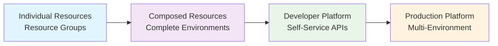

# Crossplane Advanced Patterns

Welcome to the advanced section where you'll learn to build reusable infrastructure patterns using Crossplane v2's most powerful feature: **Compositions**.

## What You'll Master

By the end of this section, you'll be able to:

- ✅ **Design Composite Resource APIs** that abstract complexity from developers
- ✅ **Build Compositions** that provision multiple Azure resources together
- ✅ **Create Developer-Friendly Interfaces** for infrastructure self-service
- ✅ **Implement Environment Strategies** for dev/staging/prod workflows
- ✅ **Handle Complex Resource Dependencies** and relationships

## From Resources to Platforms

In the fundamentals section, you learned to create individual cloud resources. Now we'll combine multiple resources into cohesive, reusable patterns that developers can easily consume.

### The Platform Engineering Journey

## Key Concepts Preview

### Composite Resource Definition (XRD)
**Purpose**: Defines the API that developers use to request infrastructure
**Analogy**: Like defining a function signature - what parameters it takes and what it returns

### Composition
**Purpose**: Implementation of how to build the infrastructure
**Analogy**: Like the function body - the actual logic that creates resources

### Composite Resource (XR)
**Purpose**: The instance created when someone uses your API
**Analogy**: Like a function call result - the actual running instance

## Module Overview

### Module 1: Your First Composition (45 minutes)
**What you'll build:** A complete development environment with networking and compute resources

**Learning focus:**
- XRD design and API patterns
- Basic Composition structure
- Resource patching and templating
- GitOps deployment of platform components

**Deliverables:**
- Working development environment API
- Reusable Composition for team use
- Developer documentation

### Module 2: Networking Composition (30 minutes)
**What you'll add:** Virtual networks, subnets, and security groups to your environment

**Learning focus:**
- Resource dependencies and references
- Advanced patching strategies
- Network security patterns
- Multi-resource orchestration

**Deliverables:**
- Complete networking stack Composition
- Security best practices implementation
- Cross-resource reference patterns

### Module 3: Environment Patterns (60 minutes)
**What you'll implement:** Different compositions for dev, staging, and production environments

**Learning focus:**
- Environment-specific configurations
- Resource sizing and scaling patterns
- Cost optimization strategies
- Multi-composition management

**Deliverables:**
- Environment-aware platform
- Cost-optimized resource patterns
- Production-ready governance

## Prerequisites Review

Ensure you've completed the Crossplane Fundamentals section:

- ✅ Azure provider configured and working
- ✅ Successfully created managed resources
- ✅ Understanding of Crossplane architecture
- ✅ Comfortable with GitOps workflows

## Design Philosophy

### Developer Experience First
- **Simple APIs**: Hide complexity behind easy-to-use interfaces
- **Self-documenting**: APIs that explain themselves
- **Fail-fast**: Clear error messages and validation
- **Consistent**: Same patterns work across environments

### Production Ready
- **Security integrated**: Proper RBAC and secret management
- **Monitoring built-in**: Health checks and observability
- **Scalable patterns**: Handle growth from dev to enterprise
- **GitOps native**: Everything managed through version control

### Enterprise Patterns
- **Governance embedded**: Policy and compliance built-in
- **Multi-tenant aware**: Isolation and resource limits
- **Cost conscious**: Right-sizing and optimization
- **Team collaborative**: Clear ownership and interfaces

## Real-World Impact

After completing this section, you'll have built a **complete Internal Developer Platform** that:

- **Developers love**: Simple YAML requests complex infrastructure
- **Operations trust**: Secure, compliant, and monitored
- **Business supports**: Cost-effective and scalable
- **Teams adopt**: Clear documentation and examples

## Time Investment

**Total time:** ~2.5 hours of hands-on exercises
**Format:** Self-paced with immediate feedback  
**Approach:** Build working platform incrementally

## Success Criteria

You'll know you've mastered these patterns when you can:

- [ ] Design intuitive APIs for infrastructure consumption
- [ ] Build Compositions that handle complex resource relationships
- [ ] Implement proper error handling and validation
- [ ] Create environment-specific deployment patterns
- [ ] Document and share platform capabilities with teams

## Ready to Build?

Let's start by creating your first Composition - a complete development environment that developers can request with a simple YAML file.

**➡️ [Module 1: Your First Composition](01-your-first-composition.md)**

---

## Platform Engineering Mindset

As you work through these modules, think like a platform engineer:

### Questions to Ask
- How can I make this easier for developers?
- What failure modes should I handle gracefully?
- How will this scale as the team grows?
- What would good documentation look like?
- How can I enforce best practices automatically?

### Principles to Follow
- **Abstract complexity, not capability**
- **Fail fast with clear error messages**
- **Document by example**
- **Version APIs thoughtfully**
- **Monitor everything**
