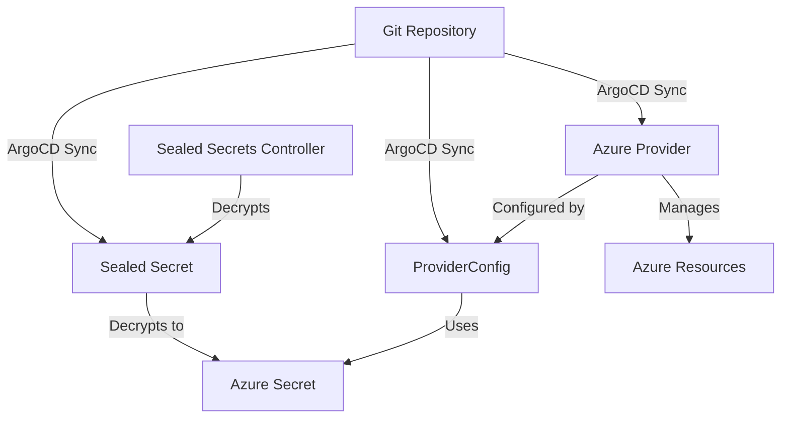

# Module 1: Azure Provider Setup

**Time:** 30-45 minutes  
**Breakdown:**
- Azure service principal setup: 10-15 minutes
- Provider configuration: 10 minutes  
- Sealed secrets creation: 10 minutes
- Verification and troubleshooting: 10 minutes

**Objective:** Configure Crossplane to securely manage Azure resources using GitOps workflows

## Overview

Before Crossplane can create Azure resources, we need to:
1. Install the Azure provider
2. Create a service principal for authentication
3. Store credentials securely using Sealed Secrets
4. Configure the provider for use

All of this will be done using GitOps principles - no manual `kubectl apply` commands!

## Prerequisites Check

Let's verify your environment is ready:

```bash
# Verify you're in your platform repository
pwd
# Should show something like: /path/to/your-platform-repo

# Verify Azure CLI is authenticated
az account show
# Should show your active subscription

# Verify Sealed Secrets is ready
kubectl get pods -n sealed-secrets -l app.kubernetes.io/name=sealed-secrets-controller
# Should show Running pod

# Verify kubeseal CLI works
kubeseal --version
# Should show version 0.24.0 or newer
```

## Step 1: Create Azure Service Principal

A service principal is a security identity that Crossplane uses to manage Azure resources on your behalf.

Skip this step, if you already have a service principal set up.

```bash
# Set environment variables for your subscription
export SUBSCRIPTION_ID=$(az account show --query id --output tsv)
export TENANT_ID=$(az account show --query tenantId --output tsv)

# Create service principal with Contributor role
echo "Creating service principal for Crossplane..."
SP_OUTPUT=$(az ad sp create-for-rbac \
  --name "crossplane-tutorial-sp" \
  --role "Contributor" \
  --scopes "/subscriptions/$SUBSCRIPTION_ID" \
  --output json)

# Extract values for later use
export CLIENT_ID=$(echo $SP_OUTPUT | jq -r '.appId')
export CLIENT_SECRET=$(echo $SP_OUTPUT | jq -r '.password')

echo "Service Principal created successfully!"
echo "CLIENT_ID: $CLIENT_ID"
echo "TENANT_ID: $TENANT_ID"
echo "SUBSCRIPTION_ID: $SUBSCRIPTION_ID"
echo "CLIENT_SECRET: [HIDDEN]"
```

> **Security Note:** The service principal secret is sensitive. We'll encrypt it using Sealed Secrets before storing in Git.

> **💰 Cost Awareness:** Most resources in this tutorial use Azure's free tier or have minimal costs. We'll focus on:
> - **Resource Groups**: Free
> - **Storage Accounts**: ~$1-2/month for basic usage
> - **App Services**: Free tier available
> - **Azure Functions**: 1M executions free monthly
> 
> **Higher-cost resources** like databases will be configured at the lowest tiers and include cleanup instructions.

## Step 2: Create Directory Structure

Let's organize our platform repository with proper structure:

```bash
# Create directories for provider configuration
mkdir -p platform-core/providers
mkdir -p platform-core/provider-configs
mkdir -p platform-core/applications

# Verify structure
tree platform-core/
```

## Step 3: Define Azure Provider

Create the provider installation manifest:

```yaml
# platform-core/providers/azure-provider.yaml
apiVersion: pkg.crossplane.io/v1
kind: Provider
metadata:
  name: provider-family-azure
  annotations:
    argocd.argoproj.io/sync-wave: "0"
spec:
  package: xpkg.upbound.io/upbound/provider-family-azure:v2.0.0
  packagePullPolicy: IfNotPresent
```

**Key points:**
- `sync-wave: "1"` ensures provider installs before configs
- We pin to a specific version for reproducibility
- `IfNotPresent` prevents unnecessary downloads

## Step 4: Create Encrypted Credentials

Now we'll create the service principal credentials as a Sealed Secret:

```bash
# Create temporary secret file (DO NOT COMMIT THIS)
cat > azure-secret-temp.yaml <<EOF
apiVersion: v1
kind: Secret
metadata:
  name: azure-secret
  namespace: crossplane-system
  labels:
    app: crossplane
    component: azure-credentials
type: Opaque
stringData:
  creds: |
    {
      "clientId": "$CLIENT_ID",
      "clientSecret": "$CLIENT_SECRET",
      "subscriptionId": "$SUBSCRIPTION_ID",
      "tenantId": "$TENANT_ID"
    }
EOF

# Encrypt with Sealed Secrets
kubeseal -o yaml < azure-secret-temp.yaml > platform-core/provider-configs/azure-credentials-sealed-secret.yaml

# Clean up temporary file immediately
rm azure-secret-temp.yaml

echo "Credentials encrypted and saved to platform-core/provider-configs/azure-credentials-sealed-secret.yaml"
```

## Step 5: Create ProviderConfig

The ProviderConfig tells Crossplane how to authenticate with Azure:

```yaml
# platform-core/provider-configs/azure-provider-config.yaml
apiVersion: azure.upbound.io/v1beta1
kind: ProviderConfig
metadata:
  name: default
  annotations:
    argocd.argoproj.io/sync-wave: "2"
spec:
  credentials:
    source: Secret
    secretRef:
      namespace: crossplane-system
      name: azure-secret
      key: creds
```

**Key points:**
- Named `default` so it's used automatically
- `sync-wave: "2"` ensures it creates after the provider
- References our sealed secret by name

## Step 6: Create ArgoCD Applications

Now we'll create ArgoCD applications to deploy our provider configuration:

```yaml
# platform-core/applications/azure-provider.yaml
apiVersion: argoproj.io/v1alpha1
kind: Application
metadata:
  name: azure-provider
  namespace: argocd
  finalizers:
    - resources-finalizer.argocd.argoproj.io
spec:
  project: default
  source:
    repoURL: __YOUR_PLATFORM_GITOPS_REPO_URL__
    targetRevision: HEAD
    path: platform-core/providers
  destination:
    server: https://kubernetes.default.svc
    namespace: crossplane-system
  syncPolicy:
    automated:
      prune: true
      selfHeal: true
    syncOptions:
      - CreateNamespace=true
      - ApplyOutOfSyncOnly=true
---
apiVersion: argoproj.io/v1alpha1
kind: Application
metadata:
  name: azure-provider-config
  namespace: argocd
  finalizers:
    - resources-finalizer.argocd.argoproj.io
spec:
  project: default
  source:
    repoURL: __YOUR_PLATFORM_GITOPS_REPO_URL__
    targetRevision: HEAD
    path: platform-core/provider-configs
  destination:
    server: https://kubernetes.default.svc
    namespace: crossplane-system
  syncPolicy:
    automated:
      prune: true
      selfHeal: true
    syncOptions:
      - CreateNamespace=true
      - ApplyOutOfSyncOnly=true
```

## Step 7: Update Repository URL

Replace the placeholder with your actual repository URL:

```bash
# Replace placeholder with your repository URL
sed -i "s|__YOUR_PLATFORM_GITOPS_REPO_URL__|$PLATFORM_GITOPS_REPO_URL|g" platform-core/applications/azure-provider.yaml
```

## Step 8: Deploy Configuration

Now let's deploy our changes through GitOps:

```bash
# Add the new provider configuration
git add platform-core/

# Simple commit for configuration addition
git commit -m "feat: add Azure provider with secure credentials"

# Push to trigger GitOps deployment
git push
```

**Note:** This is a simple configuration addition using direct git operations. For complex changes requiring review (like environment promotions), we would use PR workflows with `gh` CLI.

## Step 9: Deploy ArgoCD Applications

Apply the ArgoCD applications to start the deployment:

```bash
# Deploy the ArgoCD applications
kubectl apply -f platform-core/applications/azure-provider.yaml

# Watch the applications sync
kubectl get applications -n argocd
```

## Step 10: Verify Installation

Let's verify that everything deployed correctly:

### 10.1 Check ArgoCD Applications

```bash
# Check application status
kubectl get applications -n argocd -l app.kubernetes.io/part-of=azure-provider

# Get detailed status
kubectl describe application azure-provider -n argocd
kubectl describe application azure-provider-config -n argocd
```

### 10.2 Check Provider Installation

```bash
# List all providers
kubectl get providers

# Check Azure provider status
kubectl get provider upbound-provider-azure -o yaml | grep -A 5 status

# Look for provider pods
kubectl get pods -n crossplane-system | grep azure
```

Expected output:
```
NAME                                        READY   STATUS    RESTARTS   AGE
upbound-provider-azure-xyz                  1/1     Running   0          2m
```

### 10.3 Check ProviderConfig

```bash
# Check provider config
kubectl get providerconfig default

# Get detailed status
kubectl describe providerconfig default
```

Expected output should show `Ready: True` in the status.

### 10.4 Verify Credentials

```bash
# Check that sealed secret was decrypted
kubectl get secret azure-secret -n crossplane-system

# Verify secret has the right keys (don't view contents)
kubectl get secret azure-secret -n crossplane-system -o jsonpath='{.data}' | jq 'keys'
```

Should show: `["creds"]`

## Troubleshooting

### Provider Not Installing

```bash
# Check provider logs
kubectl logs -n crossplane-system deployment/crossplane -f

# Check if provider exists
kubectl get providers
kubectl describe provider upbound-provider-azure
```

### Authentication Issues

```bash
# Check sealed secret decryption
kubectl get sealedsecrets -n crossplane-system
kubectl describe sealedsecret azure-secret -n crossplane-system

# Check provider config status
kubectl describe providerconfig default
```

### ArgoCD Sync Issues

```bash
# Check application status
argocd app get azure-provider
argocd app get azure-provider-config

# Force sync if needed
argocd app sync azure-provider
argocd app sync azure-provider-config
```

## Understanding What You Built

### Architecture Overview



### Key Components

1. **Provider**: The Crossplane Azure provider package
2. **Sealed Secret**: Encrypted credentials safe for Git storage
3. **ProviderConfig**: Configuration telling Crossplane how to authenticate
4. **ArgoCD Applications**: GitOps deployment automation

### Security Benefits

- ✅ **No plain-text secrets** in Git repository
- ✅ **Encrypted credentials** that only cluster can decrypt
- ✅ **Least privilege** service principal with only required permissions
- ✅ **GitOps security** - all changes tracked and auditable

## Learning Outcomes

After completing this module, you should understand:

- ✅ How to install Crossplane providers using GitOps
- ✅ How to securely store cloud credentials using Sealed Secrets
- ✅ The relationship between Provider, ProviderConfig, and credentials
- ✅ How to verify provider installation and troubleshoot issues
- ✅ GitOps workflows for infrastructure component deployment

## Next Steps

Your Azure provider is now configured and ready to create resources! In the next module, we'll use it to provision your first Azure resource.

**➡️ [Module 2: Your First Managed Resource](02-first-managed-resource.md)**

---

## Quick Reference

### Useful Commands

```bash
# Check all Crossplane resources
kubectl get crossplane

# View provider status
kubectl get providers

# Check provider configs
kubectl get providerconfigs

# View crossplane logs
kubectl logs -n crossplane-system deployment/crossplane -f

# List provider CRDs
kubectl get crd | grep azure
```

### File Structure Created

```
platform-core/
├── providers/
│   └── azure-provider.yaml
├── provider-configs/
│   ├── azure-provider-config.yaml
│   └── azure-credentials-sealed-secret.yaml
└── applications/
    └── azure-provider.yaml
```
