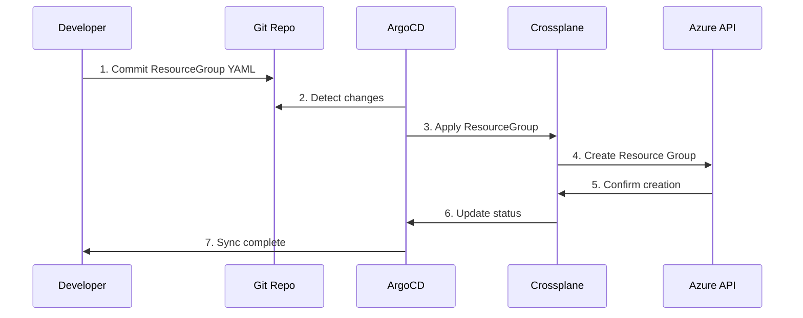

# Module 2: Your First Managed Resource

**Time:** 15 minutes  
**Objective:** Deploy a real Azure Resource Group using Crossplane and GitOps workflows

## Overview

Now that the Azure provider is configured, let's create our first cloud resource! We'll deploy an Azure Resource Group, which is a fundamental building block for organizing Azure resources.

**What you'll experience:**
1. Create a Managed Resource manifest
2. Set up GitOps deployment
3. Watch Crossplane create real Azure infrastructure
4. Verify the resource in Azure Portal

## Prerequisites Check

Ensure the previous module completed successfully:

```bash
# Verify provider is ready
kubectl get provider provider-family-azure
# Should show INSTALLED: True, HEALTHY: True

# Verify provider config exists
kubectl get providerconfig default
# Should show READY: True

# Verify Azure provider pods are running
kubectl get pods -n crossplane-system | grep azure
# Should show Running pod
```

If any of these fail, return to [Module 1](01-azure-provider-setup.md) and complete the setup.

## Step 1: Understanding Managed Resources

**Managed Resources (MRs)** are Crossplane's representation of cloud infrastructure resources. Each MR corresponds to exactly one cloud resource (1:1 relationship).

Key characteristics:
- **Declarative**: Describe desired state, Crossplane handles the implementation
- **Cloud-agnostic API**: Same patterns work across AWS, Azure, GCP
- **Kubernetes native**: Use `kubectl` and GitOps workflows
- **Lifecycle managed**: Crossplane handles creation, updates, and deletion

## Step 2: Create Directory Structure

Let's organize our resource deployment:

```bash
# Create directory for Azure resources
mkdir -p platform-core/azure/01-resource-group

# Verify structure
tree platform-core/azure/
```

## Step 3: Define Your First Managed Resource

Create an Azure Resource Group using Crossplane:

```yaml
# platform-core/azure/01-resource-group/resource-group.yaml
apiVersion: azure.upbound.io/v1beta1
kind: ResourceGroup
metadata:
  name: tutorial-rg-001
  namespace: tutorial
  labels:
    app: crossplane-tutorial
    component: resource-group
    environment: tutorial
spec:
  forProvider:
    location: East US
    tags:
      environment: tutorial
      managed-by: crossplane
      purpose: learning
      created-by: crossplane-tutorial
  providerConfigRef:
    name: default
```

**Key components explained:**

- **`apiVersion`**: Azure provider's API for Resource Groups
- **`kind: ResourceGroup`**: The specific Azure resource type
- **`metadata.name`**: Kubernetes resource name (must be unique in namespace)
- **`spec.forProvider`**: Azure-specific configuration
  - `location`: Azure region for the resource
  - `tags`: Metadata for resource organization and billing
- **`providerConfigRef`**: Which provider config to use (we created "default")

## Step 4: Create ArgoCD Application

Set up GitOps deployment for the resource:

```yaml
# platform-core/azure/01-resource-group/application.yaml
apiVersion: argoproj.io/v1alpha1
kind: Application
metadata:
  name: azure-resource-group-tutorial
  namespace: argocd
  labels:
    app: crossplane-tutorial
    component: azure-resources
  finalizers:
    - resources-finalizer.argocd.argoproj.io
spec:
  project: default
  source:
    repoURL: __YOUR_PLATFORM_GITOPS_REPO_URL__
    targetRevision: HEAD
    path: platform-core/azure/01-resource-group
  destination:
    server: https://kubernetes.default.svc
    namespace: tutorial  # v2.0: Match namespace where resources are created
  syncPolicy:
    automated:
      prune: true
      selfHeal: true
    syncOptions:
      - CreateNamespace=true
      - ApplyOutOfSyncOnly=true
  info:
    - name: 'Purpose'
      value: 'Deploy tutorial Azure Resource Group via Crossplane'
    - name: 'Resource Type'
      value: 'Azure Resource Group'
```

## Step 5: Update Repository URL

Replace the placeholder with your repository URL:

```bash
# Replace placeholder (adjust path if your repo URL env var has different name)
sed -i "s|__YOUR_PLATFORM_GITOPS_REPO_URL__|$PLATFORM_GITOPS_REPO_URL|g" platform-core/azure/01-resource-group/application.yaml
```

## Step 6: Commit and Deploy

Let's commit our changes and trigger the GitOps deployment:

```bash
# Add the new files
git add platform-core/azure/

# Commit with descriptive message
git commit -m "feat: add first managed resource - Azure Resource Group

- Create Azure Resource Group in East US region
- Deploy via ArgoCD with automated sync
- Include proper labeling and tagging
- Demonstrate Crossplane managed resource lifecycle"

# Push to trigger deployment
git push
```

## Step 7: Deploy the ArgoCD Application

Apply the ArgoCD application to start managing the resource:

```bash
# Deploy the ArgoCD application
kubectl apply -f platform-core/azure/01-resource-group/application.yaml

# Verify application was created
kubectl get application azure-resource-group-tutorial -n argocd
```

## Step 8: Watch the Magic Happen! 🎉

Now let's watch Crossplane create real Azure infrastructure:

### 8.1 Monitor ArgoCD Sync

```bash
# Watch ArgoCD sync the resource
kubectl get application azure-resource-group-tutorial -n argocd -w

# Or check sync status
argocd app get azure-resource-group-tutorial
```

### 8.2 Monitor Resource Creation

```bash
# Watch resource creation
kubectl get resourcegroup tutorial-rg-001 -n tutorial -w

# Check resource status
kubectl get resourcegroup tutorial-rg-001 -n tutorial -o yaml
```

Expected progression:
1. **Initial state**: Resource appears with `READY: False`
2. **Creating**: Crossplane calls Azure API to create resource
3. **Created**: `READY: True`, `SYNCED: True` - success! 🎉

### 8.3 Monitor Provider Logs

```bash
# Watch provider logs to see Azure API calls
kubectl logs -n crossplane-system deployment/upbound-provider-azure -f
```

You'll see logs like:
```
Successfully created resource group: tutorial-rg-001
Resource sync completed successfully
```

## Step 9: Verify in Azure Portal

Let's confirm the resource was created in Azure:

### 9.1 Using Azure CLI

```bash
# List resource groups to find ours
az group list --query "[?contains(name, 'tutorial-rg-001')]" --output table

# Get detailed information
az group show --name tutorial-rg-001 --output table
```

### 9.2 Using Azure Portal

1. Open [Azure Portal](https://portal.azure.com)
2. Navigate to "Resource Groups"
3. Look for `tutorial-rg-001`
4. Verify location is "East US"
5. Check tags match what we specified

## Step 10: Explore Resource Status

Let's examine what Crossplane provides for resource management:

### 10.1 Resource Status Fields

```bash
# Get full resource status
kubectl get resourcegroup tutorial-rg-001 -n tutorial -o yaml
```

Key status fields:
- **`conditions`**: Health and sync status
- **`atProvider`**: Actual state from Azure
- **`observedGeneration`**: Last processed spec version

### 10.2 Resource Events

```bash
# Check Kubernetes events for the resource
kubectl describe resourcegroup tutorial-rg-001 -n tutorial | grep -A 10 Events

# Or get events directly
kubectl get events -n tutorial --field-selector involvedObject.name=tutorial-rg-001
```

### 10.3 Resource Conditions

```bash
# Check resource conditions
kubectl get resourcegroup tutorial-rg-001 -n crossplane-system -o jsonpath='{.status.conditions}' | jq '.'
```

Healthy resource should show:
- `Ready: True`
- `Synced: True`
- `LastSyncTime`: Recent timestamp

## Understanding What Happened

### The GitOps Flow



### Crossplane Resource Lifecycle

1. **Creation**: Crossplane detects new resource, calls Azure API
2. **Monitoring**: Continuously polls Azure for status changes
3. **Updates**: If spec changes, Crossplane updates Azure resource
4. **Deletion**: If resource deleted from Git, Crossplane removes from Azure

## Experiment Time! 🧪

Let's make a change to see the reconciliation in action:

### Modify Resource Tags

```bash
# Edit the resource group file
vim platform-core/azure/01-resource-group/resource-group.yaml
```

Add a new tag to the `spec.forProvider.tags` section:
```yaml
spec:
  forProvider:
    tags:
      environment: tutorial
      managed-by: crossplane
      purpose: learning
      created-by: crossplane-tutorial
      modified-at: "$(date -u +%Y-%m-%dT%H:%M:%SZ)"  # Add this line
```

```bash
# Commit the change
git add platform-core/azure/01-resource-group/resource-group.yaml
git commit -m "feat: add timestamp tag to resource group"
git push

# Watch Crossplane update the Azure resource
kubectl get resourcegroup tutorial-rg-001 -n tutorial -w
```

Verify in Azure:
```bash
# Check updated tags
az group show --name tutorial-rg-001 --query tags
```

## Troubleshooting Common Issues

### Resource Stuck in Creating State

```bash
# Check resource events
kubectl describe resourcegroup tutorial-rg-001 -n tutorial

# Check provider logs
kubectl logs -n crossplane-system deployment/upbound-provider-azure --tail=50

# Verify provider config
kubectl describe providerconfig default
```

### ArgoCD Sync Issues

```bash
# Check application status
argocd app get azure-resource-group-tutorial

# Force sync if needed
argocd app sync azure-resource-group-tutorial

# Check for sync errors
kubectl describe application azure-resource-group-tutorial -n argocd
```

### Permission Issues

```bash
# Verify service principal has correct permissions
az role assignment list --assignee $CLIENT_ID --output table

# Check if subscription is correct
kubectl get secret azure-secret -n crossplane-system -o jsonpath='{.data.creds}' | base64 -d | jq '.subscriptionId'
```

## Learning Outcomes

After completing this module, you should understand:

- ✅ **Managed Resources** represent cloud resources in Crossplane
- ✅ **GitOps workflow** for infrastructure deployment
- ✅ **Resource lifecycle** - creation, monitoring, updates, deletion
- ✅ **Status monitoring** and troubleshooting techniques
- ✅ **Real-world impact** - Git commits create cloud infrastructure!

## Key Concepts Reinforced

### Declarative Infrastructure
- You declared "I want a Resource Group with these properties"
- Crossplane handled all the implementation details
- Changes to declaration trigger automatic reconciliation

### GitOps Benefits
- **Version control**: All changes tracked in Git
- **Audit trail**: Who changed what and when
- **Rollback capability**: Git revert undoes infrastructure changes
- **Collaboration**: Team can review infrastructure changes via PRs

### Security Integration
- Credentials remain encrypted in Git
- Only authorized clusters can decrypt and use credentials
- All API calls use least-privilege service principal

## Next Steps

Congratulations! You've successfully created your first cloud resource using Crossplane and GitOps. You now have real Azure infrastructure managed by Git commits.

In the next module, we'll explore what happened under the hood and learn more about Crossplane's architecture and troubleshooting techniques.

**➡️ [Module 3: Understanding What Happened](03-understanding-crossplane.md)**

---

## Quick Reference

### Resource Status Commands

```bash
# Quick status check
kubectl get resourcegroups -n azure-resource-group

# Detailed resource info
kubectl describe resourcegroup tutorial-rg-001 -n azure-resource-group

# Watch resource changes
kubectl get resourcegroup tutorial-rg-001 -n azure-resource-group -w

# Get resource YAML
kubectl get resourcegroup tutorial-rg-001 -n azure-resource-group -o yaml
```

## Step 5: Complete Verification Guide

### Kubernetes Verification Commands

```bash
# Check if resource is created and ready
kubectl get resourcegroup tutorial-rg-001 -n azure-resource-group
# Expected: STATUS should be "Ready" after 2-3 minutes

# View detailed status and conditions
kubectl describe resourcegroup tutorial-rg-001 -n azure-resource-group
# Look for: Status conditions showing "Ready: True"

# Watch resource creation progress  
kubectl get resourcegroup tutorial-rg-001 -n azure-resource-group -w
# Watch until STATUS changes from "Creating" to "Ready"

# Get complete resource YAML with Azure details
kubectl get resourcegroup tutorial-rg-001 -n azure-resource-group -o yaml
# Contains Azure resource ID and connection details
```

### Azure CLI Verification Commands

```bash
# List all resource groups to confirm creation
az group list --output table
# Look for: tutorial-rg-001 in East US region

# Show specific resource group details
az group show --name tutorial-rg-001 --output table
# Expected: State should be "Succeeded"

# Verify all tags were applied correctly
az group show --name tutorial-rg-001 --query tags
# Expected: Should show environment, managed-by, purpose, created-by tags

# Confirm resource group location
az group show --name tutorial-rg-001 --query location
# Expected: "eastus"
```

### ArgoCD Verification

```bash
# Check application sync status
kubectl get application azure-resource-group-tutorial -n argocd
# Expected: SYNC STATUS: "Synced", HEALTH STATUS: "Healthy"

# Get detailed application status
argocd app get azure-resource-group-tutorial
# Shows complete dependency tree and sync history
```

### Expected Results Summary

**✅ Successful deployment indicators:**
- kubectl shows ResourceGroup with STATUS: "Ready"  
- ArgoCD shows application as "Synced" and "Healthy"
- Azure CLI shows resource group in "Succeeded" state
- All tags are present and correct in Azure
- Location matches specification (East US)

**🔧 Troubleshooting common issues:**
- **STATUS shows "Creating" for >5 minutes** → Check Azure service principal permissions
- **STATUS shows "Failed"** → Check Azure quotas and subscription limits  
- **ArgoCD shows "OutOfSync"** → Resource may have been modified outside Crossplane
- **Resource not visible in Azure** → Check subscription context with `az account show`

## Cleanup Resources

To remove the resources created in this exercise:

```bash
# Delete the managed resource by removing the configuration file
rm platform-core/azure/01-resource-group/resource-group.yaml
git add -A
git commit -m "cleanup: remove tutorial resource group"
git push

# Verify deletion in Azure (after ArgoCD sync)
az group show --name tutorial-rg-001
# Expected: ResourceGroupNotFound error after GitOps cleanup
```

**Cost Note:** Resource Groups themselves don't incur charges, but always clean up resources to develop good habits for more expensive resources like databases and compute instances.

### Files Created

```
platform-core/azure/01-resource-group/
├── resource-group.yaml    # The Azure Resource Group definition
└── application.yaml       # ArgoCD application for GitOps deployment
```
