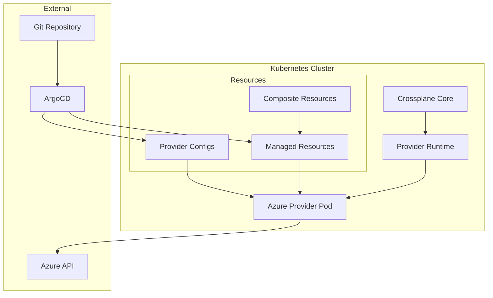
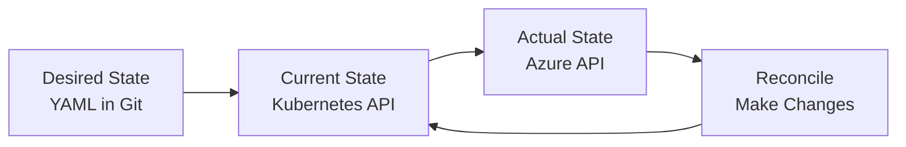

# Module 3: Understanding What Happened

**Time:** 15 minutes  
**Objective:** Explore Crossplane architecture, resource lifecycle, and troubleshooting techniques

## Overview

You've successfully created Azure infrastructure using Git commits and Crossplane v2.0! Now let's dive deep into what happened behind the scenes, focusing on the new v2.0 architecture patterns.

## Key v2.0 Architecture Changes

Before exploring troubleshooting, let's understand what makes Crossplane v2.0 different:

### **Namespaced Resources**
- **User resources** (like your ResourceGroup) live in namespaces like `tutorial`
- **System components** (like providers) stay in `crossplane-system`  
- **Better isolation** and RBAC control through namespace boundaries

### **Simplified Resource Model**
- **No Claims** needed - you create managed resources directly in namespaces
- **Cleaner separation** between user resources and system components
- **Direct resource management** without intermediate claim objects

## What We'll Explore

1. **Crossplane Architecture** - Components and their roles
2. **Resource Reconciliation** - How Crossplane manages state
3. **Status and Conditions** - Understanding resource health
4. **Troubleshooting Techniques** - Debugging common issues
5. **Best Practices** - Production-ready patterns

## Crossplane Architecture Deep Dive

### Core Components



### Component Roles

#### Crossplane Core
- **Purpose**: Orchestrates the entire system
- **Responsibilities**: 
  - Manages provider lifecycle
  - Handles composite resource logic
  - Coordinates between components
- **Location**: `crossplane-system` namespace

```bash
# View Crossplane core
kubectl get deployment crossplane -n crossplane-system
kubectl logs deployment/crossplane -n crossplane-system --tail=20
```

#### Provider Runtime
- **Purpose**: Generic controller framework
- **Responsibilities**:
  - Resource reconciliation loops
  - API client management
  - Error handling and retries
- **Shared**: Used by all providers

#### Azure Provider Pod
- **Purpose**: Azure-specific resource management
- **Responsibilities**:
  - Azure API authentication
  - Resource CRUD operations
  - Status reporting back to Kubernetes
- **Location**: Runs as deployment in `crossplane-system`

```bash
# View Azure provider
kubectl get pods -n crossplane-system | grep azure
kubectl logs deployment/upbound-provider-azure -n crossplane-system --tail=20
```

## Resource Reconciliation Explained

### The Control Loop

Crossplane uses Kubernetes' controller pattern with continuous reconciliation:



### Reconciliation Process

Let's trace what happened when you created the Resource Group:

#### 1. Initial Detection
```bash
# ArgoCD detected changes in Git
kubectl logs deployment/argocd-application-controller -n argocd | grep tutorial-rg-001
```

#### 2. Resource Creation
```bash
# Check when resource was first created
# Check when resource was created
kubectl get resourcegroup tutorial-rg-001 -n tutorial -o jsonpath='{.metadata.creationTimestamp}'
```

#### 3. Provider Processing
```bash
# View provider logs for our resource
kubectl logs deployment/upbound-provider-azure -n crossplane-system | grep tutorial-rg-001
```

#### 4. Azure API Calls
The provider made these API calls to Azure:
1. **Authentication**: Used service principal credentials
2. **Create**: Called Azure Resource Manager API
3. **Polling**: Checked creation status
4. **Success**: Updated Kubernetes with final state

## Understanding Resource Status

### Status Fields Deep Dive

Let's examine your Resource Group's status:

```bash
# Get full status information
# Check resource status
kubectl get resourcegroup tutorial-rg-001 -n tutorial -o jsonpath='{.status}' | jq '.'
```

#### Key Status Components

##### Conditions
```bash
# Check resource conditions
# Check conditions (health status)
kubectl get resourcegroup tutorial-rg-001 -n tutorial -o jsonpath='{.status.conditions}' | jq '.'
```

**Standard conditions:**
- **`Ready`**: Resource is fully provisioned and healthy
- **`Synced`**: Kubernetes state matches Azure state
- **`LastSyncTime`**: When last reconciliation occurred

##### AtProvider
```bash
# Check actual Azure state
kubectl get resourcegroup tutorial-rg-001 -n tutorial -o jsonpath='{.status.atProvider}' | jq '.'
```

**Contains:**
- Azure resource ID
- Current tags
- Actual location
- Provisioning state

##### ObservedGeneration
```bash
# Check generation tracking
kubectl get resourcegroup tutorial-rg-001 -n tutorial -o jsonpath='{.status.observedGeneration}'
kubectl get resourcegroup tutorial-rg-001 -n tutorial -o jsonpath='{.metadata.generation}'
```

**Purpose**: Tracks if status reflects latest spec changes

## Hands-On Troubleshooting

### Scenario 1: Unhealthy Resource

Let's intentionally create a problematic resource to practice troubleshooting:

```yaml
# Create a resource with invalid location
cat > /tmp/broken-rg.yaml <<EOF
apiVersion: azure.upbound.io/v1beta1
kind: ResourceGroup
metadata:
  name: broken-rg
  namespace: tutorial  # v2.0: User resources in tutorial namespace
spec:
  forProvider:
    location: "Invalid-Region"  # This will fail
    tags:
      purpose: troubleshooting-demo
EOF

# Apply the broken resource
kubectl apply -f /tmp/broken-rg.yaml
```

#### Troubleshooting Steps

1. **Check Resource Status**
```bash
# Look at overall status
kubectl get resourcegroup broken-rg -n tutorial

# Check conditions for errors
kubectl describe resourcegroup broken-rg -n tutorial
```

2. **Examine Events**
```bash
# Look for error events
kubectl get events -n tutorial --field-selector involvedObject.name=broken-rg
```

3. **Check Provider Logs**
```bash
# Look for provider errors
kubectl logs deployment/upbound-provider-azure -n crossplane-system | grep broken-rg
```

4. **Fix the Issue**
```bash
# Update with correct location
kubectl patch resourcegroup broken-rg -n tutorial --type='merge' -p='{"spec":{"forProvider":{"location":"East US"}}}'

# Watch it recover
kubectl get resourcegroup broken-rg -n tutorial -w
```

5. **Clean Up**
```bash
# Remove test resource
kubectl delete resourcegroup broken-rg -n tutorial
rm /tmp/broken-rg.yaml
```

### Scenario 2: Provider Authentication Issues

Let's simulate and troubleshoot authentication problems:

#### Check Current Authentication
```bash
# Verify ProviderConfig status
kubectl describe providerconfig default

# Check secret exists and has correct keys
kubectl get secret azure-secret -n crossplane-system -o jsonpath='{.data}' | jq 'keys'
```

#### Common Authentication Errors
```bash
# Look for auth errors in provider logs
kubectl logs deployment/upbound-provider-azure -n crossplane-system | grep -i "auth\|credential\|permission"
```

**Typical issues:**
- Expired service principal secret
- Insufficient RBAC permissions
- Wrong subscription ID
- Invalid tenant ID

## Best Practices for Production

### 1. Resource Naming

✅ **Good naming pattern:**
```yaml
metadata:
  name: myapp-prod-eastus-rg-001
  labels:
    app: myapp
    environment: prod
    region: eastus
    resource-type: resource-group
```

❌ **Poor naming:**
```yaml
metadata:
  name: rg1  # Too generic, no context
```

### 2. Proper Labeling and Tagging

✅ **Comprehensive labeling:**
```yaml
metadata:
  labels:
    app: myapp
    component: infrastructure
    environment: production
    managed-by: crossplane
    team: platform
spec:
  forProvider:
    tags:
      Environment: production
      ManagedBy: crossplane
      Team: platform-engineering
      CostCenter: "1234"
      Project: myapp
```

### 3. Resource Organization

```bash
# Organize by environment and component
platform-core/
├── azure/
│   ├── dev/
│   │   ├── networking/
│   │   └── compute/
│   ├── staging/
│   │   ├── networking/
│   │   └── compute/
│   └── prod/
│       ├── networking/
│       └── compute/
```

### 4. Monitoring and Alerting

```bash
# Set up monitoring for resource health
kubectl get resourcegroups -n crossplane-system -o jsonpath='{range .items[*]}{.metadata.name}{"\t"}{.status.conditions[?(@.type=="Ready")].status}{"\n"}{end}'
```

## Advanced Debugging Techniques

### 1. Resource Finalizers

Understanding how cleanup works:

```bash
# Check finalizers on your resource
kubectl get resourcegroup tutorial-rg-001 -n crossplane-system -o jsonpath='{.metadata.finalizers}'
```

Finalizers ensure proper cleanup order:
- `finalizer.managedresource.crossplane.io`

### 2. Provider-Specific Debugging

```bash
# Enable debug logging (if needed)
kubectl set env deployment/upbound-provider-azure -n crossplane-system --list

# Check provider configuration
kubectl get provider upbound-provider-azure -o yaml | grep -A 10 status
```

### 3. Resource Relationships

```bash
# Find all resources managed by our ProviderConfig
kubectl get managed -n crossplane-system | grep default
```

## Performance and Scale Considerations

### Resource Limits
```bash
# Check provider resource usage
kubectl top pod -n crossplane-system | grep azure

# View resource limits
kubectl describe deployment upbound-provider-azure -n crossplane-system | grep -A 5 Limits
```

### Reconciliation Frequency
- **Default**: Every 60 seconds for healthy resources
- **Backoff**: Exponential backoff for failed resources
- **Immediate**: On spec changes

```bash
# Check reconciliation timing
kubectl get resourcegroup tutorial-rg-001 -n crossplane-system -o jsonpath='{.status.conditions[?(@.type=="Synced")].lastTransitionTime}'
```

## Cleanup and Resource Lifecycle

### Understanding Deletion

When you delete a Crossplane resource:

1. **Finalizer prevents immediate deletion**
2. **Provider receives deletion event**
3. **Azure resource is deleted**
4. **Finalizer is removed**
5. **Kubernetes resource is deleted**

### Safe Cleanup

```bash
# View deletion policy (if set)
kubectl get resourcegroup tutorial-rg-001 -n crossplane-system -o jsonpath='{.spec.deletionPolicy}'

# Safe deletion
kubectl delete resourcegroup tutorial-rg-001 -n crossplane-system

# Verify Azure resource is also deleted
az group show --name tutorial-rg-001 --output table 2>/dev/null || echo "Resource Group successfully deleted from Azure"
```

## Learning Outcomes

After completing this module, you should understand:

- ✅ **Crossplane Architecture** - Core components and their roles
- ✅ **Reconciliation Loop** - How Crossplane maintains desired state
- ✅ **Resource Status** - Reading and interpreting resource health
- ✅ **Troubleshooting** - Systematic approach to debugging issues
- ✅ **Best Practices** - Production-ready patterns and conventions
- ✅ **Resource Lifecycle** - Creation, updates, and deletion processes

## Key Insights

### The Power of Declarative Infrastructure
- **Intent-based**: You declare what you want, not how to achieve it
- **Self-healing**: System continuously works toward desired state
- **Consistent**: Same patterns work across all cloud providers

### GitOps Benefits Realized
- **Audit trail**: Every change tracked in version control
- **Collaboration**: Infrastructure changes via code review
- **Rollback**: Git revert = infrastructure rollback
- **Automation**: No manual cloud console clicking

### Production Readiness
- **Monitoring**: Resource health visible via Kubernetes APIs
- **Security**: Credentials encrypted and rotated
- **Scale**: Handles thousands of resources efficiently

## Congratulations! 🎉

You've completed the Crossplane Fundamentals section! You now have:

- ✅ **Working knowledge** of Crossplane v2 architecture
- ✅ **Hands-on experience** creating Azure resources via GitOps
- ✅ **Troubleshooting skills** for common issues
- ✅ **Foundation** for building more complex infrastructure patterns

## Next Steps

You're ready to move beyond individual resources to building reusable infrastructure patterns. The next section will introduce Compositions - Crossplane's powerful abstraction mechanism.

**➡️ [Advanced Patterns: Compositions](../advanced-patterns/01-your-first-composition.md)**

---

## Quick Reference

### Debugging Commands Cheatsheet

```bash
# Resource health check
kubectl get <resource-type> <name> -n crossplane-system

# Detailed resource information
kubectl describe <resource-type> <name> -n crossplane-system

# Provider logs
kubectl logs deployment/upbound-provider-azure -n crossplane-system --tail=50

# ArgoCD application status
argocd app get <app-name>

# Resource events
kubectl get events -n crossplane-system --field-selector involvedObject.name=<name>

# Provider health
kubectl get providers
kubectl describe provider upbound-provider-azure

# ProviderConfig status
kubectl get providerconfigs
kubectl describe providerconfig default
```

### Resource Status Fields

- **`conditions[].type`**: `Ready`, `Synced`, `Healthy`
- **`conditions[].status`**: `True`, `False`, `Unknown`
- **`conditions[].reason`**: Brief explanation
- **`atProvider`**: Current state from cloud provider
- **`observedGeneration`**: Last processed spec version
