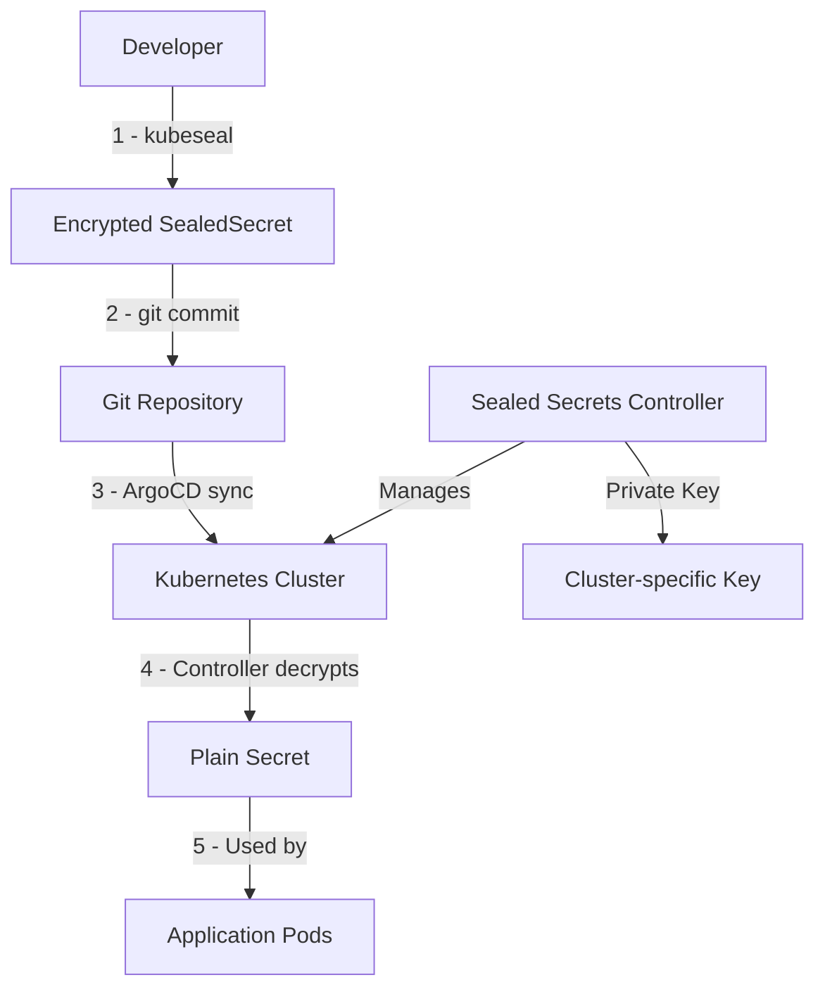

# 05: Secure Secret Management (Sealed Secrets)

Now that we have ArgoCD managing our platform, we need to add secure secret management capabilities. Sealed Secrets allows us to encrypt sensitive data and store it safely in Git repositories, following GitOps security best practices.

## Why Sealed Secrets?

Traditional Kubernetes secrets pose a security challenge in GitOps workflows:  
- **Plain text secrets** cannot be safely stored in Git repositories  
- **Base64 encoding** provides no real security  
- **External secret stores** add complexity for development environments

Sealed Secrets solve this by providing:  
- ✅ **Encryption at source** - Secrets are encrypted before being stored in Git.  
- ✅ **GitOps compatible** - Encrypted secrets can be safely committed.  
- ✅ **Cluster-specific** - Only the target cluster can decrypt the secrets.  
- ✅ **Developer friendly** - Simple CLI tool for encrypting secrets.  

## Architecture Overview



## Installation Steps

### 1. Install Sealed Secrets Controller

We'll install the Sealed Secrets controller using GitOps principles through ArgoCD.

#### 1.1 Create Sealed Secrets Application Manifest

Create the ArgoCD application in `platform-core/sealed-secrets-controller.yaml` to install Sealed Secrets:

```yaml
# platform-core/sealed-secrets-controller.yaml
apiVersion: argoproj.io/v1alpha1
kind: Application
metadata:
  name: sealed-secrets-controller
  namespace: argocd
  finalizers:
    - resources-finalizer.argocd.argoproj.io
spec:
  project: default
  source:
    repoURL: https://bitnami-labs.github.io/sealed-secrets
    targetRevision: 2.17.3
    chart: sealed-secrets
    helm:
      values: |
        fullnameOverride: sealed-secrets-controller
        resources:
          limits:
            cpu: 200m
            memory: 256Mi
          requests:
            cpu: 100m
            memory: 128Mi
        metrics:
          serviceMonitor:
            enabled: false
  destination:
    server: https://kubernetes.default.svc
    namespace: sealed-secrets
  syncPolicy:
    automated:
      prune: true
      selfHeal: true
    syncOptions:
    - CreateNamespace=true
    - RespectIgnoreDifferences=true
```

#### 1.2 Commit and Sync the repository

```bash
git add platform-core/sealed-secrets-controller.yaml
git commit -m "Add Sealed Secrets Controller"
gh repo sync
```

#### 1.3 Watch the deployment

```bash
kubectl get applications -n argocd sealed-secrets-controller
kubectl get pods -n sealed-secrets -l app.kubernetes.io/name=sealed-secrets-controller
```

### 2. Install kubeseal CLI Tool

The `kubeseal` CLI tool is used to encrypt secrets locally before committing them to Git.

#### 2.1 Install via DevBox (Recommended)

Kubeseal is already included in your DevBox environment (see: `devbox.json`).

Verify installation:

```bash
kubeseal --version
```

#### 2.2 Alternative Installation Methods

**macOS (Homebrew):**
```bash
brew install kubeseal
```

**Linux (Binary Download):**
```bash
# Download the latest release
KUBESEAL_VERSION='0.24.0'
wget "https://github.com/bitnami-labs/sealed-secrets/releases/download/v${KUBESEAL_VERSION}/kubeseal-${KUBESEAL_VERSION}-linux-amd64.tar.gz"
tar -xvzf kubeseal-${KUBESEAL_VERSION}-linux-amd64.tar.gz kubeseal
sudo install -m 755 kubeseal /usr/local/bin/kubeseal
```

### 3. Verify Installation

#### 3.1 Check Controller Status

```bash
# Verify the sealed secrets controller is running
kubectl get pods -n sealed-secrets -l app.kubernetes.io/name=sealed-secrets

# Check the controller logs
kubectl logs -n sealed-secrets -l app.kubernetes.io/name=sealed-secrets

# Verify the CRD is installed
kubectl get crd sealedsecrets.bitnami.com
```

#### 3.2 Test CLI Connectivity

```bash
# Test kubeseal CLI can communicate with the controller
kubeseal --fetch-cert --controller-namespace=sealed-secrets --controller-name=sealed-secrets-controller > public-cert.pem

# Verify the certificate was retrieved
cat public-cert.pem
```

## Your First Sealed Secret

Let's create a test sealed secret to verify everything is working.

### 1. Create a Regular Secret (Temporarily)

```bash
# Create a test secret (don't commit this!)
cat > test-secret.yaml <<EOF
apiVersion: v1
kind: Secret
metadata:
  name: test-secret
  namespace: default
type: Opaque
stringData:
  username: admin
  password: super-secret-password
EOF
```

### 2. Encrypt the Secret

```bash
# Encrypt the secret using kubeseal
kubeseal -o yaml < test-secret.yaml > test-sealed-secret.yaml

# Clean up the unencrypted secret
rm test-secret.yaml
```

### 3. Examine the Sealed Secret

```bash
# Look at the encrypted secret - safe to commit!
cat test-sealed-secret.yaml
```

You'll see output like:
```yaml
apiVersion: bitnami.com/v1alpha1
kind: SealedSecret
metadata:
  name: test-secret
  namespace: default
spec:
  encryptedData:
    password: AgBy3i4OJSWK+PiTySYZZA9rO43cGDEQAx...
    username: AgAKAoiQm7QDhh+EoKJvGb5nSW8uaY7NOAd...
  template:
    metadata:
      name: test-secret
      namespace: default
    type: Opaque
```

### 4. Apply and Verify

```bash
# Apply the sealed secret
kubectl apply -f test-sealed-secret.yaml

# Verify it was decrypted automatically
kubectl get secret test-secret -o yaml

# Clean up test resources
kubectl delete -f test-sealed-secret.yaml
rm test-sealed-secret.yaml public-cert.pem
```

## GitOps Integration

### Update Your GitOps Repository

Now that Sealed Secrets is installed, update your platform repository structure:

```bash
# Add to your platform repository
git add platform-core/sealed-secrets-controller.yaml
git commit -m "feat: add sealed secrets controller for secure secret management"
git push
```

### Verify ArgoCD Sync

Check that ArgoCD has successfully deployed Sealed Secrets:

```bash
# Check ArgoCD application status
argocd app get sealed-secrets-controller

# Verify in ArgoCD UI
kubectl port-forward svc/argocd-server -n argocd 8080:443
```

Log in to ArgoCD at https://localhost:8080 and verify the `sealed-secrets-controller` application is healthy and synced.

## Best Practices

### 1. Secret Naming Conventions

```yaml
# Use descriptive names and proper namespacing
metadata:
  name: azure-crossplane-credentials
  namespace: crossplane-system
```

### 2. Scope Secrets Appropriately

```bash
# Cluster-wide secret (default)
kubeseal -o yaml < secret.yaml > sealed-secret.yaml

# Namespace-scoped secret (more secure)
kubeseal --scope namespace-wide -o yaml < secret.yaml > sealed-secret.yaml

# Strict mode (name and namespace must match exactly)
kubeseal --scope strict -o yaml < secret.yaml > sealed-secret.yaml
```

### 3. Certificate Management

```bash
# Backup the encryption certificate (store securely!)
kubectl get secret -n sealed-secrets sealed-secrets-key -o yaml > sealed-secrets-master-key.yaml

# For disaster recovery, you can restore the key:
# kubectl apply -f sealed-secrets-master-key.yaml
```

### 4. Development Workflow

```bash
# 1. Create secret template
cat > secret.yaml <<EOF
apiVersion: v1
kind: Secret
metadata:
  name: my-app-secret
  namespace: default
type: Opaque
stringData:
  api-key: "your-secret-value"
EOF

# 2. Encrypt with kubeseal
kubeseal -o yaml < secret.yaml > sealed-secret.yaml

# 3. Remove plain text secret
rm secret.yaml

# 4. Commit encrypted secret
git add sealed-secret.yaml
git commit -m "feat: add encrypted API key for my-app"
git push
```

## Security Considerations

### ✅ Safe Practices
- Always delete unencrypted secret files after sealing
- Use appropriate scoping (strict/namespace-wide/cluster-wide)
- Backup and secure the master encryption key
- Rotate secrets periodically

### ❌ Avoid These Mistakes
- Never commit unencrypted secrets to Git
- Don't share the master encryption key publicly
- Avoid using cluster-wide scope for sensitive secrets
- Don't modify encrypted data manually

## Troubleshooting

### Common Issues

**1. kubeseal can't connect to controller:**
```bash
# Check if controller is running
kubectl get pods -n sealed-secrets -l app.kubernetes.io/name=sealed-secrets

# Check service endpoint
kubectl get svc -n sealed-secrets sealed-secrets-controller
```

**2. Certificate fetch fails:**
```bash
# Explicitly specify controller details
kubeseal --fetch-cert \
  --controller-namespace=sealed-secrets \
  --controller-name=sealed-secrets-controller
```

**3. Sealed secret not decrypting:**
```bash
# Check controller logs
kubectl logs -n sealed-secrets -l app.kubernetes.io/name=sealed-secrets

# Verify sealed secret format
kubectl describe sealedsecret <secret-name>
```

## Next Steps

With Sealed Secrets now configured, you can:

1. **Securely store cloud credentials** for Crossplane providers
2. **Manage application secrets** through GitOps workflows  
3. **Follow security best practices** from development through production
4. **Scale secret management** across multiple environments

Sealed Secrets is now a foundational component of your GitOps platform, enabling secure secret management throughout the tutorial.

## Congratulations!

You've successfully extended your Kubernetes cluster with enterprise-grade secret management capabilities. Your platform now supports:

- ✅ **Secure GitOps workflows** with encrypted secrets
- ✅ **Developer-friendly** secret encryption process
- ✅ **Production-ready** security practices
- ✅ **Foundation** for Crossplane credential management

**➡️ [Next Section: Crossplane Integration](../crossplane-fundamentals/01-provider-setup.md)**
